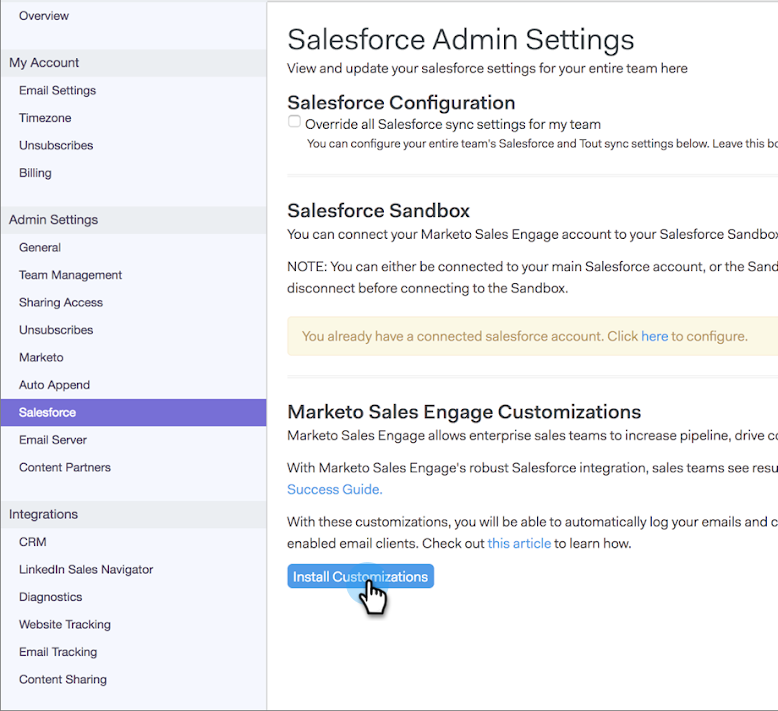

# Come installare personalizzazioni nella sandbox Salesforce {#how-to-install-customizations-in-your-salesforce-sandbox}

>[!NOTE]
>
>**Autorizzazioni amministratore richieste**

>[!PREREQUISITES]
>
>[Connetti vendite Connetti alla tua sandbox Salesforce](/help/marketo/product-docs/marketo-sales-connect/crm/salesforce-customization/how-to-connect-sales-connect-to-your-salesforce-sandbox.md)

1. In [!DNL Sales Connect], fare clic sull'icona ingranaggio in alto a destra e selezionare **[!UICONTROL Settings]**.

   

1. In [!UICONTROL Admin Settings] fare clic su **[!UICONTROL Salesforce]**.

   

1. Fai clic su **[!UICONTROL Install Customizations]**.

   

   Quindi, è sufficiente eseguire i passaggi necessari per installare la personalizzazione come si farebbe con un account [!DNL Salesforce] normale.
