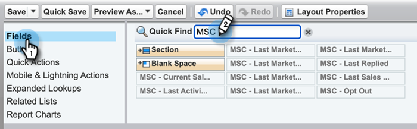

# Disinstalla Marketo Sales Connect da Salesforce Classic {#uninstall-marketo-sales-connect-from-salesforce-classic}

Di seguito viene illustrato come disinstallare il pacchetto Marketo Sales Connect dall&#39;account Salesforce una volta che si inizia a utilizzare Sales Insight Actions.

## Rimuovi [!DNL Sales Connect] campi dal layout pagina {#remove-sales-connect-fields-from-page-layout}

1. In [!DNL Salesforce] Classic, fare clic su **[!UICONTROL Setup]**.

   

1. Nella barra di navigazione a sinistra, in [!UICONTROL Build], espandi (ma non fare clic su) [!UICONTROL Customize], quindi [!UICONTROL Leads]. Quindi, selezionare **[!UICONTROL Page Layouts]**.

   

1. Fare clic su **[!UICONTROL Edit]** accanto a Layout lead.

   

1. Nella console selezionare **[!UICONTROL Fields]**. In Ricerca rapida, cercare &quot;MSC&quot;. Tutti i campi disattivati sono stati aggiunti al layout della pagina. Dovrai eliminarli.

   

   >[!NOTE]
   >
   >Se nessuno dei campi è disattivato, significa che non sono stati aggiunti al layout di pagina. Puoi saltare questa sezione.

1. Scorri fino alla sezione contenente i tuoi campi personalizzati [!DNL Sales Connect].

   

1. È possibile aggiungere a questa sezione 10 tipi di campi MSC. Rimuovi tutti i campi aggiunti o elimina semplicemente l’intera sezione.

1. Al termine, fai clic su **[!UICONTROL Quick Save]**.

   

## Rimuovi [!DNL Sales Connect] pulsanti dai layout di pagina {#remove-sales-connect-buttons-from-page-layouts}

1. Nella console (passaggio 4), selezionare **[!UICONTROL Buttons]**. Cercare &quot;MSC&quot;. Tutti i pulsanti disattivati sono stati aggiunti alla sezione dei pulsanti personalizzati. Dovrai eliminarli.

   

   >[!NOTE]
   >
   >Se nessuno dei pulsanti è disattivato, significa che non sono stati aggiunti. Puoi saltare questa sezione.

1. Trascinare i pulsanti MSC dalla sezione [!UICONTROL Custom Buttons] alla console.

   

1. Al termine, fai clic su **[!UICONTROL Quick Save]**.

   

## Rimuovi [!DNL Sales Connect] campi dalla sezione [!UICONTROL Activity History] {#remove-sales-connect-fields-from-activity-history-section}

1. Scorrere fino alla parte inferiore della pagina fino alla sezione dell&#39;elenco correlato a [!UICONTROL Activity History] e fare clic sull&#39;icona chiave inglese.

   

1. Selezionare i campi [!DNL Sales Connect] dall&#39;area [!UICONTROL Selected Fields] e fare clic sulla freccia [!UICONTROL Remove]. Al termine, fai clic su **[!UICONTROL OK]**.

   

   >[!NOTE]
   >
   >L&#39;abbreviazione MSE _è_ [!DNL Sales Connect]. È solo il nome precedente, &quot;Marketo Sales Engage&quot;.

1. Fai clic su **Salva** quando hai finito con la pagina Lead.

## Rimuovi [!DNL Sales Connect] pulsanti di azione in blocco dalla vista elenco lead {#remove-sales-connect-bulk-action-buttons-from-lead-list-view}

1. Nella barra di navigazione a sinistra, in [!UICONTROL Build], espandi (ma non fare clic su) [!UICONTROL Customize], quindi [!UICONTROL Leads]. Quindi, selezionare **[!UICONTROL Search Layouts]**.

   

1. Accanto alla visualizzazione elenco lead, fare clic su **[!UICONTROL Edit]**.

   

1. Selezionare **[!UICONTROL Add to MSC Campaign (Classic)]**, **[!UICONTROL Email with MSC (Classic)]** e **[!UICONTROL Push to MSC (Classic)]**, quindi fare clic sulla freccia [!UICONTROL Remove]. Quindi fai clic su **[!UICONTROL Save]**.

   

I pulsanti non dovrebbero più essere visualizzati nella vista elenco lead.

## Rimuovi configurazione MSC per contatti {#remove-msc-configuration-for-contacts}

1. In [!DNL Salesforce], fare clic su **[!UICONTROL Setup]**.

1. Nella barra di navigazione a sinistra, in [!UICONTROL Build], espandi (ma non fare clic su) [!UICONTROL Customize], quindi [!UICONTROL Contacts]. Quindi, selezionare **[!UICONTROL Page Layouts]**.

1. Accanto a Layout contatto fare clic su **[!UICONTROL Edit]**.

1. Ripeti i passaggi da tutte e tre le sezioni.

## Rimuovi configurazione MSC per opportunità {#remove-msc-configuration-for-opportunity}

1. In [!DNL Salesforce], fare clic su **[!UICONTROL Setup]**.

1. Nella barra di navigazione a sinistra, in [!UICONTROL Build], espandi (ma non fare clic su) [!UICONTROL Customize], quindi [!UICONTROL Opportunities]. Quindi, selezionare **[!UICONTROL Page Layouts]**.

1. Accanto a Layout opportunità, fare clic su **[!UICONTROL Edit]**.

1. Ripeti i passaggi da tutte e tre le sezioni.

La visualizzazione dell’opportunità dispone di un solo pulsante: &quot;Invia e-mail MSE&quot; e dei campi seguenti:

## Rimuovi configurazione MSC per l&#39;account {#remove-msc-configuration-for-account}

1. In [!DNL Salesforce], fare clic su **[!UICONTROL Setup]**.

1. Nella barra di navigazione a sinistra, in [!UICONTROL Build], espandi (ma non fare clic su) [!UICONTROL Customize], quindi [!UICONTROL Account]. Quindi, selezionare **[!UICONTROL Page Layouts]**.

1. Accanto a Layout account, fare clic su **[!UICONTROL Edit]**.

1. Ripeti i passaggi da tutte e tre le sezioni.

La visualizzazione Account include un solo pulsante: &quot;Invia e-mail MSE&quot; e i campi seguenti:

## Rimuovi Marketo Sales Outbox {#remove-marketo-sales-outbox}

1. In [!DNL Salesforce], fai clic sulla scheda **+** nella parte superiore dello schermo.

1. Fai clic su **[!UICONTROL Customize My Tabs]**.

1. Selezionare l&#39;opzione Marketo Sales Outbox a destra. Fare clic sulla freccia [!UICONTROL Remove], quindi su **[!UICONTROL Save]**.

## Elimina pacchetto [!DNL Sales Connect] {#delete-sales-connect-package}

Dopo aver rimosso tutti gli oggetti dal tuo account Salesforce, segui i passaggi indicati di seguito.

1. In [!DNL Salesforce], fare clic su **[!UICONTROL Setup]**.

1. Nella casella Ricerca rapida immettere &quot;Classi apex&quot;.

1. Fai clic su **Elimina** accanto a tutte le voci &quot;MarketoSalesConnectionCustomization&quot; o &quot;MarketoSalesEngageCustomization&quot; nel tuo elenco.

È tutto pronto!

Di seguito è riportato un elenco di tutti gli oggetti che devono essere rimossi dall’istanza Salesforce:

## Dettagli personalizzazione [!DNL Sales Connect] {#sales-connect-customization-details}

<table>
 <tr>
  <th>Campi attività personalizzati</th>
  <th>Descrizione</th>
  <th>Tipo</th>
  <th>Tipo di dati</th>
 </tr>
 <tr>
  <td>[!UICONTROL MSC Call Local Presence ID]</td>
  <td>Come utente, posso scegliere Presenza locale come opzione quando effettuo chiamate dal telefono MSC. Le chiamate in arrivo mostreranno un numero locale per il ricevente</td>
  <td>Attività</td>
  <td>Testo</td>
 </tr>
 <tr>
  <td>[!UICONTROL MSC Call Recording URL]</td>
  <td>È possibile registrare le chiamate e qui verrà registrato un collegamento per la registrazione </td>
  <td>Attività</td>
  <td>Testo</td>
 </tr>
 <tr>
  <td>[!UICONTROL MSC Campaign]</td>
  <td>Nome del registro della campagna MSC su cui si trova il contatto/lead</td>
  <td>Attività</td>
  <td>Testo</td>
 </tr>
 <tr>
  <td>[!UICONTROL MSC Campaign URL]</td>
  <td>Registra l’URL della campagna creata in MSC. Cliccando su questo si aprirà la campagna nell'app web MSC</td>
  <td>Attività</td>
  <td>Testo</td>
 </tr>
 <tr>
  <td>[!UICONTROL MSC Campaign Current Step]</td>
  <td>Se un contatto/lead fa parte di una campagna, questo campo registra il nome del passaggio in cui si trova</td>
  <td>Attività</td>
  <td>Casella di controllo</td>
 </tr>
 <tr>
  <td>[!UICONTROL MSC Email Attachment Viewed]</td>
  <td>Registra i dati quando un’e-mail viene inviata con un allegato visualizzato dal destinatario</td>
  <td>Attività</td>
  <td>Casella di controllo</td>
 </tr>
 <tr>
  <td>[!UICONTROL MSC Email Clicked]</td>
  <td>Registra un segno di spunta quando il destinatario fa clic su un collegamento nell’e-mail</td>
  <td>Attività</td>
  <td>Casella di controllo</td>
 </tr>
 <tr>
  <td>[!UICONTROL MSC Email Replied]</td>
  <td>Registra un segno di spunta quando il destinatario risponde all’e-mail</td>
  <td>Attività</td>
  <td>Testo</td>
 </tr>
 <tr>
  <td>[!UICONTROL MSC Email Status]</td>
  <td>Mostra se un’e-mail è inviata/in corso/non recapitata (il tracciamento delle e-mail non recapitate dipende dal canale di consegna utilizzato)</td>
  <td>Attività</td>
  <td>Testo</td>
 </tr>
 <tr>
  <td>[!UICONTROL MSC Email Template]</td>
  <td>Nome del registro del modello MSC utilizzato nell’e-mail inviata al lead/contatto</td>
  <td>Attività</td>
  <td>Testo</td>
 </tr>
 <tr>
  <td>[!UICONTROL MSC Email Template URL]</td>
  <td>Registra l’URL del modello creato in MSC. Facendo clic su questa icona si aprirà il modello nell’app Web MSC</td>
  <td>Attività</td>
  <td>Testo</td>
 </tr>
 <tr>
  <td>[!UICONTROL MSC Email URL]</td>
  <td>Facendo clic su questo URL si aprirà il centro comandi in MSC e si aprirà la scheda People Detail View history (Visualizzazione dettagli persone) in cui l’utente potrà visualizzare l’e-mail inviata</td>
  <td>Attività</td>
  <td>Testo</td>
 </tr>
 <tr>
  <td>[!UICONTROL MSC Email Viewed]</td>
  <td>Registra un segno di spunta quando il destinatario visualizza un messaggio e-mail</td>
  <td>Attività</td>
  <td>Casella di controllo</td>
 </tr>
</table>

<table>
 <tr>
  <th>Campo di registrazione rollup MSC</th>
  <th>Descrizione</th>
  <th>Tipo</th>
  <th>Tipo di dati</th>
 </tr>
 <tr>
  <td>MSC - Ultimo impegno di marketing</td>
  <td>Ultimo coinvolgimento in arrivo dal marketing</td>
  <td>
  
Account
  
Contatto
  
Lead
  
Opportunità</td>
  <td>Dati e ora</td>
 </tr>
 <tr>
  <td>MSC - Data ultimo accordo di marketing</td>
  <td>Timestamp del coinvolgimento da Marketing</td>
  <td>
  
Account
  
Contatto
  
Lead
  
Opportunità</td>
  <td>Dati e ora</td>
 </tr>
 <tr>
  <td>MSC - Descrizione ultimo coinvolgimento marketing</td>
  <td>Descrizione del progetto</td>
  <td>
  
Account
  
Contatto
  
Lead
  
Opportunità</td>
  <td>Testo</td>
 </tr>
 <tr>
  <td>MSC - Ultimo Source di coinvolgimento marketing</td>
  <td>Source del coinvolgimento nel marketing</td>
  <td>
  
Account
  
Contatto
  
Lead
  
Opportunità</td>
  <td>Testo</td>
 </tr>
 <tr>
  <td>MSC - Ultimo tipo di coinvolgimento marketing</td>
  <td>Tipo di coinvolgimento (ad esempio, attività Web)</td>
  <td>
  
Account
  
Contatto
  
Lead
  
Opportunità</td>
  <td>Testo</td>
 </tr>
 <tr>
  <td>MSC - Ultima attività per vendite</td>
  <td>Ultima attività in uscita eseguita dal team vendite</td>
  <td>
  
Account
  
Contatto
  
Lead
  
Opportunità</td>
  <td>Dati e ora</td>
 </tr>
 <tr>
  <td>MSC - Ultima risposta</td>
  <td>Ultima risposta e-mail all’e-mail di vendita</td>
  <td>
  
Account
  
Contatto
  
Lead
  
Opportunità</td>
  <td>Dati e ora</td>
 </tr>
 <tr>
  <td>MSC - Campagna di vendita corrente</td>
  <td>Nome del registro della campagna MSC su cui si trova il contatto/lead</td>
  <td>
  
Account
  
Contatto
  
Lead
  
Opportunità</td>
  <td>Testo</td>
 </tr>
 <tr>
  <td>MSC - Ultimo accordo di vendita</td>
  <td>Ultimo impegno in entrata dalle vendite</td>
  <td>
  
Account
  
Contatto
  
Lead
  
Opportunità</td>
  <td>Dati e ora</td>
 </tr>
 <tr>
  <td>MSC - Rinuncia</td>
  <td>Campo di rinuncia</td>
  <td>
  
Account
  
Contatto
  
Lead
  
Opportunità</td>
  <td>Casella di controllo</td>
 </tr>
</table>

<table>
 <tr>
  <th>Pulsanti MSC</th>
  <th>Descrizione</th>
  <th>Tipo</th>
 </tr>
 <tr>
  <td>[!UICONTROL Send MSC Email]</td>
  <td>Invia e-mail di vendita da [!DNL Salesforce]</td>
  <td>
  
Account
  
Contatto
  
Lead
  
Opportunità</td>
 </tr>
 <tr>
  <td>[!UICONTROL Add to MSC Campaign]</td>
  <td>Aggiungi a campagne MSC da [!DNL Salesforce]</td>
  <td>
  
Contatto
  
Lead</td>
 </tr>
 <tr>
  <td>[!UICONTROL Push to MSC]</td>
  <td>Invia contatto da [!DNL Salesforce] a MSC</td>
  <td>
  
Contatto
  
Lead</td>
 </tr>
 <tr>
  <td>[!UICONTROL Call with MSC]</td>
  <td>Effettua chiamate di vendita da [!DNL Salesforce]</td>
  <td>
  
Contatto
  
Lead</td>
 </tr>
</table>

<table>
 <tr>
  <th>Pulsanti azione in blocco MSC</th>
  <th>Descrizione</th>
  <th>Tipo</th>
 </tr>
 <tr>
  <td>[!UICONTROL Add to MSC Campaign (Classic)]</td>
  <td>Aggiungi a campagne MSC da [!DNL Salesforce]</td>
  <td>
  
Contatto
  
Lead</td>
 </tr>
 <tr>
  <td>[!UICONTROL Push to MSC (Classic)]</td>
  <td>Invia contatto da [!DNL Salesforce] a MSC</td>
  <td>
  
Contatto
  
Lead</td>
 </tr>
 <tr>
  <td>[!UICONTROL Email with MSC (Classic)]</td>
  <td>E-mail con MSC da [!DNL Salesforce]</td>
  <td>
  
Contatto
  
Lead</td>
 </tr>
</table>
