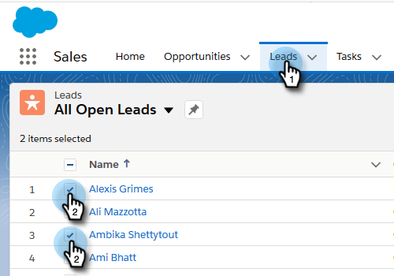

# Utilizzo di azioni di massa in Salesforce Lightning {#using-bulk-actions-in-salesforce-lightning}

Scopri come eseguire azioni in massa, come aggiungere lead a una campagna, inviare un messaggio e-mail in massa o inviare i lead da Salesforce a Sales Connect.

>[!PREREQUISITES]
>
>Effettuate l&#39;aggiornamento alla versione più recente del pacchetto Sales Connect e installate i pulsanti di azione in blocco nella vista lead/contatto. [Fare clic qui per le istruzioni](https://s3.amazonaws.com/tout-user-store/salesforce/assets/SF+Guide+for+Lightning.pdf).

>[!NOTE]
>
>Prima di seguire i passaggi indicati di seguito, verifica di aver effettuato l&#39;accesso al tuo account Marketing Sales Connect.

## E-mail di massa {#bulk-email}

1. In Salesforce, fare clic sulla scheda **Lead**, quindi scegliere l&#39;elenco dei lead desiderati.

   

   >[!NOTE]
   >
   >Se siete già sulla lista che userete, dovrete eseguire nuovamente la lista scegliendo dall&#39;elenco a discesa per essere certi che i pulsanti di azione sfusi MSC siano visualizzati. Si tratta di un comportamento Salesforce che non può essere modificato.

1. Fare clic sul menu a discesa freccia (all&#39;estrema destra dello schermo) e selezionare **E-mail con MSC**.

   

1. Verrà visualizzato un messaggio e-mail MSC. Include le seguenti funzionalità:

   a. Il campo &quot;A&quot; mostra &quot;Tutte le ricevute&quot;, corrispondente all’elenco di lead scelto nella vista Elenco lead\
   b. Questo elenco è visibile nel pannello a sinistra chiamato &quot;Composizione in blocco&quot;. È possibile aggiungere o rimuovere i destinatari qui\
   c. Potete scegliere un modello o creare un messaggio e-mail personalizzato\
   d. Potete inviare l&#39;e-mail immediatamente o pianificare l&#39;invio in un secondo momento

   

## Aggiungi alla campagna {#add-to-campaign}

1. In Salesforce, fare clic sulla scheda **Lead**, quindi scegliere l&#39;elenco dei lead desiderati.

   

1. Fate clic sul menu a discesa freccia (all&#39;estrema destra della schermata) e selezionate **Aggiungi a MSC Campaign**.

   

1. Viene visualizzata una finestra a comparsa &quot;Aggiungi persone alla campagna&quot;. Fate clic su **Next** e seguite il flusso di campagne tipico per attivare una campagna MSC.

   

## Push to Marketo Sales Connect {#push-to-marketo-sales-connect}

1. In Salesforce, fare clic sulla scheda **Lead**, quindi scegliere l&#39;elenco dei lead desiderati.

   

1. Fare clic sul menu a discesa freccia (all&#39;estrema destra dello schermo) e selezionare **Premi a MSC**.

   

1. Viene aperta una nuova scheda denominata &quot;Salesforce Bridge&quot;. Fare clic sul pulsante **Procedi al gruppo →**.

   

1. Verrai inviato al tuo account MSC dove vedrai un gruppo creato con data/ora. Riceverai una notifica al termine della sincronizzazione e il gruppo includerà i lead sincronizzati da Salesforce.

   

>[!NOTE]
>
>Potete seguire gli stessi passaggi per utilizzare le azioni in blocco anche nella vista Elenco contatti.

>[!MORELIKETHIS]
>
>* [Invio di e-mail tramite e-mail di gruppo](/help/marketo/product-docs/marketo-sales-connect/email/using-the-compose-window/sending-emails-via-group-email.md)
>* [Composizione di e-mail in blocco con Seleziona e invia](/help/marketo/product-docs/marketo-sales-connect/email/using-the-compose-window/composing-bulk-emails-with-select-and-send.md#sending-emails)

