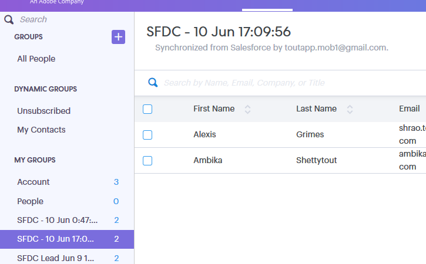

# Utilizzo di azioni in blocco in [!DNL Salesforce Lightning] {#using-bulk-actions-in-salesforce-lightning}

Scopri come eseguire azioni in blocco, come l’aggiunta di lead a una campagna, l’invio di un’e-mail in blocco o il push di lead da [!DNL Salesforce] a [!DNL Sales Connect].

>[!PREREQUISITES]
>
>Eseguire l&#39;aggiornamento alla versione più recente del pacchetto [!DNL Sales Connect] e installare i pulsanti di azione collettiva nella visualizzazione lead/contatti.
>* [Istruzioni in inglese] (assets/SF+Guide+for+Lightning-EN)
>* [Istruzioni in giapponese] (assets/SF+Guide+for+Lightning-JA)

>[!NOTE]
>
>Prima di eseguire la procedura seguente, verificare di aver effettuato l&#39;accesso al proprio account [!DNL Marketo Sales Connect].

## E-mail in blocco {#bulk-email}

1. In [!DNL Salesforce], fai clic sulla scheda **[!UICONTROL Leads]**, quindi scegli l&#39;elenco dei lead desiderati.

   

   >[!NOTE]
   >
   >Se sei già presente nell’elenco che utilizzerai, dovrai eseguirlo nuovamente scegliendolo dall’elenco a discesa per assicurarti che vengano visualizzati i pulsanti delle azioni in blocco MSC. Questo è il comportamento [!DNL Salesforce] che non può essere modificato.

1. Fare clic sull&#39;elenco a discesa della freccia (all&#39;estrema destra dello schermo) e selezionare **[!UICONTROL Email with MSC]**.

   

1. Verrà visualizzata un&#39;e-mail MSC. Include le seguenti funzionalità:

   a. Il campo &quot;[!UICONTROL To]&quot; mostra &quot;Tutte le ricezioni&quot; - corrisponde all&#39;elenco di lead scelti nella visualizzazione elenco lead
b. Questo elenco è visibile nel pannello a sinistra denominato &quot;Composizione in blocco&quot;. Qui puoi aggiungere/rimuovere i destinatari
c. Puoi scegliere un modello o creare un messaggio e-mail personalizzato
d. Puoi inviare l’e-mail immediatamente o pianificare l’invio in un secondo momento

   

## Aggiungi a campagna {#add-to-campaign}

1. In [!DNL Salesforce], fai clic sulla scheda **[!UICONTROL Leads]**, quindi scegli l&#39;elenco dei lead desiderati.

   

1. Fare clic sull&#39;elenco a discesa della freccia (all&#39;estrema destra dello schermo) e selezionare **[!UICONTROL Add to MSC Campaign]**.

   

1. Verrà visualizzato un pop-up &quot;[!UICONTROL Add People to Your Campaign]&quot;. Fai clic su **[!UICONTROL Next]** e segui il flusso tipico delle campagne per attivare una campagna MSC.

   

## Invia a [!DNL Marketo Sales Connect] {#push-to-marketo-sales-connect}

1. In [!DNL Salesforce], fai clic sulla scheda **[!UICONTROL Leads]**, quindi scegli l&#39;elenco dei lead desiderati.

   

1. Fare clic sull&#39;elenco a discesa della freccia (all&#39;estrema destra dello schermo) e selezionare **[!UICONTROL Push to MSC]**.

   

1. Verrà aperta una nuova scheda denominata &quot;[!DNL Salesforce] Bridge&quot;. Fare clic sul pulsante **[!UICONTROL Proceed to Group]→**.

   

1. Verrai indirizzato al tuo account MSC, dove vedrai un gruppo creato con data/ora. Riceverai una notifica una volta completata la sincronizzazione e il gruppo includerà i lead sincronizzati da [!DNL Salesforce].

   

>[!NOTE]
>
>È possibile seguire gli stessi passaggi per utilizzare azioni in blocco anche nella visualizzazione elenco contatti.

>[!MORELIKETHIS]
>
>* [Invio di e-mail tramite e-mail gruppo](/help/marketo/product-docs/marketo-sales-connect/email/using-the-compose-window/sending-emails-via-group-email.md)
>* [Composizione di e-mail in blocco con Seleziona e invia](/help/marketo/product-docs/marketo-sales-connect/email/using-the-compose-window/composing-bulk-emails-with-select-and-send.md#sending-emails)
