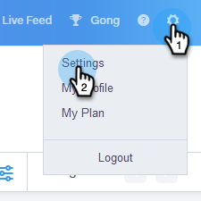
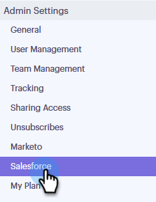
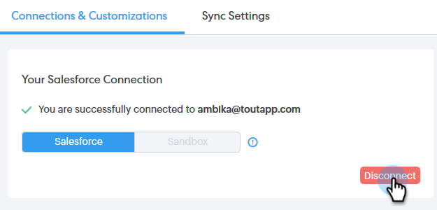
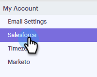
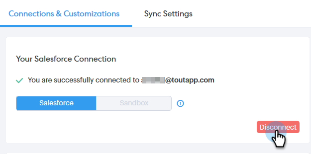

# Disconnettere Salesforce dall’account Sales Connect {#disconnect-salesforce-from-your-sales-connect-account}

A volte potrebbe essere necessario disconnettere l&#39;account [!DNL  Salesforce] dall&#39;account [!DNL Sales Connect]. Ecco come.

## Come disconnettersi da Salesforce come amministratore {#how-to-disconnect-from-salesforce-as-an-admin}

1. In [!DNL Sales Connect], fare clic sull&#39;icona ingranaggio in alto a destra e selezionare **[!UICONTROL Settings]**.

   

1. In [!UICONTROL  Admin Settings], fare clic su **[!UICONTROL Salesforce]**.

   

1. Nella scheda [!UICONTROL Connections & Customizations], fare clic su **[!UICONTROL Disconnect]**.

   

## Come disconnettersi da Salesforce come utente non amministratore {#how-to-disconnect-from-salesforce-as-a-non-admin}

1. In [!DNL  Sales Connect], fare clic sull&#39;icona ingranaggio in alto a destra e selezionare **[!UICONTROL Settings]**.

   

1. In [!UICONTROL My Account], selezionare **[!UICONTROL Salesforce]**.

   

1. Nella scheda [!UICONTROL Connections & Customizations], fare clic su **[!UICONTROL Disconnect]**.

   
