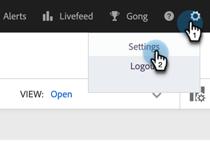
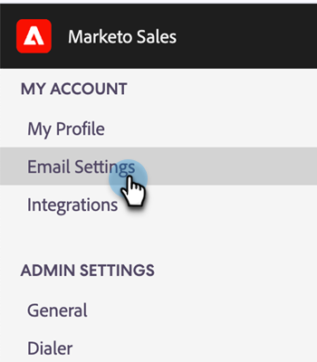

# Installare il plug-in e-mail di Sales Connect per Gmail {#install-the-sales-connect-email-plugin-for-gmail}

Scopri come installare il plug-in Gmail.

>[!IMPORTANT]
>
>I plug-in e-mail per Gmail e Outlook sono supportati solo per gli utenti di Marketo Sales Connect. Sono **non** supportati per gli utenti delle azioni di Sales Insight.

1. Nell&#39;[applicazione Web](https://toutapp.com/next#settings), fare clic sull&#39;icona a forma di ingranaggio e quindi su **[!UICONTROL Settings]**.

   

1. In Account personale fare clic su **[!UICONTROL Email Settings]**.

   

1. Fai clic sulla scheda **[!UICONTROL Plugins]**.

   

1. In App Gmail e Google, fare clic su **[!UICONTROL Install]**.

   
