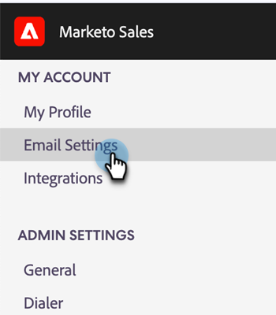

# Installare il plug-in e-mail di Sales Connect per Gmail {#install-the-sales-connect-email-plugin-for-gmail}

Scopri come installare il plug-in Gmail.

>[!IMPORTANT]
>
>I plug-in e-mail per Gmail e Outlook sono supportati solo per gli utenti di Marketo Sales Connect. Sono **non** supportati per gli utenti delle azioni Sales Insight.

1. Nell&#39;[applicazione Web](https://toutapp.com/next#settings), fare clic sull&#39;icona a forma di ingranaggio e quindi su **[!UICONTROL Impostazioni]**.

   

1. In Il mio account, fai clic su **[!UICONTROL Impostazioni e-mail]**.

   

1. Fare clic sulla scheda **[!UICONTROL Plugin]**.

   

1. In App Gmail e Google fare clic su **[!UICONTROL Installa]**.

   
