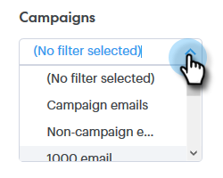
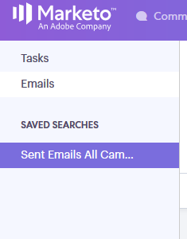

# Panoramica della ricerca avanzata {#advanced-search-overview}

Utilizzando la ricerca avanzata per rivolgerti ai potenziali clienti che hanno visualizzato, fatto clic o risposto alle e-mail, puoi creare un elenco mirato dei potenziali clienti più coinvolti.

## Accesso alla ricerca avanzata {#how-to-access-advanced-search}

1. Fai clic su **Centro comandi**.

   

1. Fai clic su **E-mail**.

   

1. Scegli la scheda applicabile.

   

1. Fai clic su **Ricerca avanzata**.

   

## Filtri {#filters}

**Data**

Scegli l’intervallo di date per la ricerca. Le date predefinite vengono aggiornate a seconda dello stato dell’e-mail scelto (Inviato, Non consegnato, In sospeso).

**Chi**

Filtrare per destinatario/mittente dell’e-mail nella sezione Chi .

| Elenco a discesa | Descrizione |
|---|---|
| **Visualizza come** | Filtrare per un mittente specifico nell&#39;istanza di Sales Connect (questa opzione è disponibile solo per gli amministratori). |
| **Per gruppo** | Filtrare le e-mail per un gruppo specifico di destinatari. |
| **Per persona** | Filtrare per un destinatario specifico. |

**Quando**

Scegli per data di creazione, data di consegna, data di mancato recapito o data pianificata. Le opzioni disponibili variano a seconda dello stato dell’e-mail scelto (Inviato, Non consegnato, In sospeso).

**Campagne**

Filtrare le e-mail in base alla partecipazione alla campagna.

**Stato**

Sono disponibili tre stati e-mail tra cui scegliere. Le opzioni tipo/attività cambiano in base allo stato selezionato.

***Stato: Inviato***

Filtri per l’attività e-mail inviata. È possibile scegliere viste/nessuna vista, clic/nessun clic e/o risposte/nessuna risposta.

***Stato: In sospeso***

Filtra per tutte le e-mail in sospeso.

| Stato | Descrizione |
|---|---|
| **Pianificato** | E-mail pianificate dalla finestra di composizione (Salesforce o l’app Web), dai plug-in e-mail o da una campagna. |
| **Bozze** | E-mail attualmente in stato di bozza. Le e-mail richiedono una riga dell’oggetto e un destinatario per essere salvate come bozza. |
| **In corso** | E-mail in corso di invio. Le e-mail non devono rimanere in questo stato per più di pochi secondi. |

***Stato: Non consegnato***

Filtri per e-mail che non sono mai stati consegnati.

| Stato | Descrizione |
|---|---|
| **Non riuscito** | Quando un messaggio e-mail non viene inviato da Sales Connect (i motivi comuni includono: e-mail inviate a contatti non abbonati/bloccati o in caso di problemi durante la compilazione dei campi dinamici). |
| **Rimbalzato** | Un messaggio e-mail viene contrassegnato come rimbalzato quando viene rifiutato dal server del destinatario. Qui vengono visualizzate solo le e-mail inviate tramite i server di Sales Connect. |
| **Spam** | Quando l’e-mail è stata contrassegnata come spam (termine comune per e-mail non richieste) dal destinatario. Qui vengono visualizzate solo le e-mail inviate tramite i server di Sales Connect. |

## Ricerche salvate {#saved-searches}

Ecco come creare una ricerca salvata.

1. Dopo aver inserito tutti i filtri, fai clic su **Salva filtri con nome**.

   

1. Assegna un nome alla ricerca e fai clic su **Salva**.

   

   Le ricerche salvate si troveranno nella barra laterale a sinistra.

   
