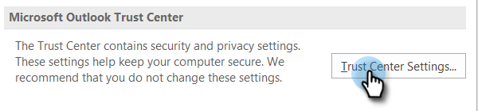

# Impedire le visualizzazioni autonome {#preventing-self-views}

## Panoramica {#overview}

Ottenendo falsi positivi sul tracciamento della visualizzazione possono verificarsi incoerenze nei rapporti. Ciò si verifica spesso quando gli utenti di MSC richiamano accidentalmente il pixel di tracciamento dal loro client e-mail (lo chiamiamo una visualizzazione automatica). Di seguito sono riportati alcuni suggerimenti per ridurre in modo significativo e persino eliminare le viste personali.

## Web (Outlook Web App e Gmail) {#web-outlook-web-app-and-gmail}

In Sales Connect viene memorizzato un cookie nel browser, per impedire che le viste vengano tracciate all&#39;apertura dei messaggi e-mail dall&#39;app Web Outlook e da Gmail. Se ricevete ancora una vista personale, vi consigliamo di effettuare le seguenti operazioni:

* Verificare che nel computer siano abilitati i cookie.

* Se usate un nuovo computer o dispositivo mobile, accertatevi di aver effettuato l’accesso all’applicazione Web. Questo ci permetterà di riconoscere il vostro computer/dispositivo in futuro.

## Desktop (Windows) {#desktop-windows}

Le visualizzazioni vengono tracciate scaricando un piccolo pixel immagine invisibile nel client e-mail. È possibile ridurre notevolmente la quantità di visualizzazioni personalizzate in Outlook disattivando il download automatico delle immagini. Di seguito sono riportati i passaggi da seguire.

1. In Outlook, fare clic su **File** nella barra dei menu.

   

1. Fare clic su **Opzioni**.

   

1. Nella finestra di dialogo Opzioni di Outlook, fare clic su **Centro protezione**.

   

1. In Centro protezione Microsoft Outlook fare clic su **Impostazioni centro protezione**.

   

1. Fate clic su Scarica automatica nel menu a sinistra, quindi selezionate la casella di controllo **Non scaricare automaticamente le immagini nel messaggio e-mail HTML o negli elementi RSS**.

   

1. Fare clic su **OK** nella finestra di dialogo Centro protezione.

   

1. Fare clic su **OK** nella finestra di dialogo Opzioni di Outlook.

   

## Desktop (Mac) {#desktop-mac}

Le visualizzazioni vengono tracciate scaricando un piccolo pixel immagine invisibile nel client e-mail. È possibile ridurre notevolmente la quantità di visualizzazioni personalizzate in Outlook disattivando il download automatico delle immagini. Di seguito sono riportati i passaggi da seguire.

1. In Outlook, fare clic su **Outlook** nella barra dei menu e selezionare **Preferenze**.

   

1. In E-mail, scegliere **Lettura**.

   

1. In Protezione, fare clic sul pulsante di scelta **Mai**.

   
