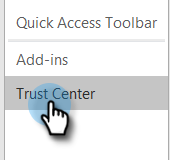

# Impedire visualizzazioni automatiche {#preventing-self-views}

## Panoramica {#overview}

Ottenere falsi positivi per il tracciamento delle visualizzazioni può causare incongruenze nei rapporti. Ciò si verifica spesso quando gli utenti di MSC richiamano accidentalmente il pixel di tracciamento dal proprio client e-mail (questa funzione viene chiamata visualizzazione automatica). Di seguito sono riportati alcuni suggerimenti su come ridurre ed eliminare in modo significativo le visualizzazioni personali.

## Web ([!DNL Outlook Web App] e Gmail) {#web-outlook-web-app-and-gmail}

[!DNL Sales Connect] memorizzerà un cookie nel browser per impedire il rilevamento delle visualizzazioni all&#39;apertura delle e-mail da Outlook Web App e Gmail. Se ricevi ancora visualizzazioni personali, ti consigliamo di effettuare le seguenti operazioni:

* Verificare che nel computer siano abilitati i cookie.

* Se utilizzi un nuovo computer o dispositivo mobile, assicurati di aver effettuato l’accesso all’applicazione web. In questo modo sarà possibile riconoscere il computer o il dispositivo in uso.

## Desktop (Windows) {#desktop-windows}

Le visualizzazioni vengono tracciate scaricando un piccolo pixel di immagine invisibile nel client e-mail. È possibile ridurre in modo significativo la quantità di visualizzazioni automatiche in [!DNL Outlook] disabilitando il download automatico delle immagini. Di seguito sono riportati i passaggi come.

1. In [!DNL Outlook], fare clic su **[!UICONTROL File]** nella barra dei menu.

   

1. Fai clic su **[!UICONTROL Options]**.

   

1. Nella finestra di dialogo Opzioni [!DNL Outlook] fare clic su **[!UICONTROL Trust Center]**.

   

1. In [!UICONTROL Microsoft Outlook Trust Center], fare clic su **[!UICONTROL Trust Center Settings]**.

   

1. Fare clic su [!UICONTROL Automatic Download] nel menu a sinistra e selezionare la casella di controllo **[!UICONTROL Don't download pictures automatically in HTML email or RSS items]**.

   

1. Fare clic su **[!UICONTROL OK]** nella finestra di dialogo [!UICONTROL Trust Center].

   

1. Fare clic su **[!UICONTROL OK]** nella finestra di dialogo Opzioni [!DNL Outlook].

   

## Desktop (Mac) {#desktop-mac}

Le visualizzazioni vengono tracciate scaricando un piccolo pixel di immagine invisibile nel client e-mail. È possibile ridurre in modo significativo la quantità di visualizzazioni automatiche in [!DNL Outlook] disabilitando il download automatico delle immagini. Di seguito sono riportati i passaggi come.

1. In [!DNL Outlook], fare clic su **[!UICONTROL Outlook]** nella barra dei menu e selezionare **[!UICONTROL Preferences]**.

   

1. In [!UICONTROL Email] scegliere **[!UICONTROL Reading]**.

   

1. In [!UICONTROL Security] fare clic sul pulsante di opzione **[!UICONTROL Never]**.

   
