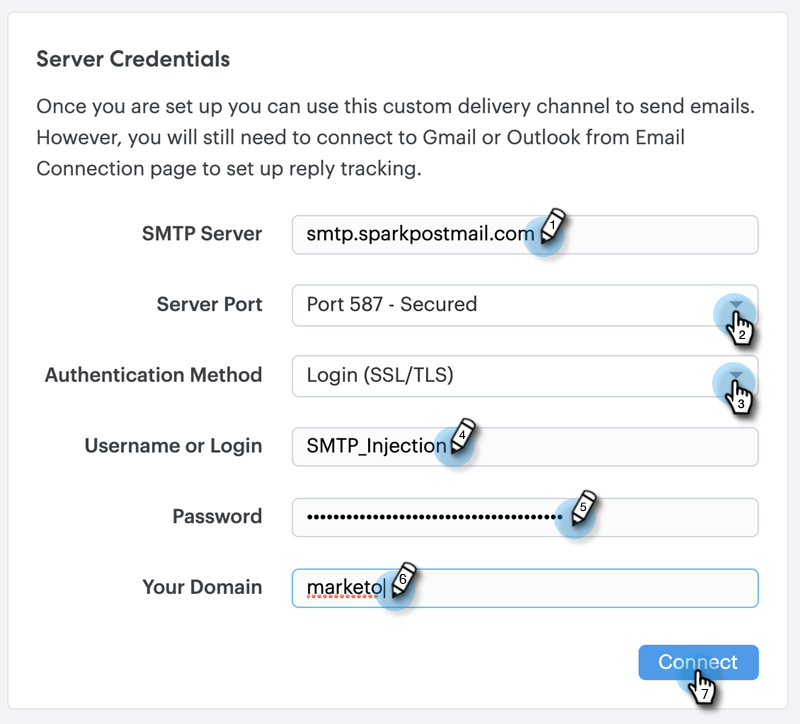
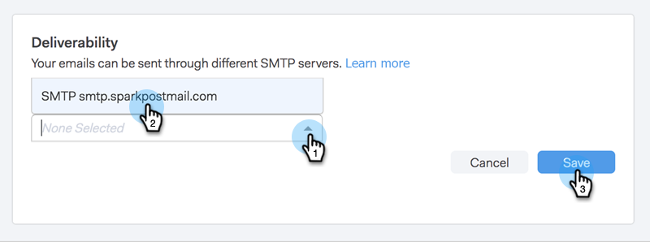

# Configurare un canale di consegna personalizzato {#setting-up-a-custom-delivery-channel}

[!DNL Marketo Sales Connect] consente l&#39;integrazione con un server SMTP personalizzato per la consegna delle e-mail. Si tratta di un&#39;ottima opzione per coloro che non desiderano inviare e-mail in blocco dal proprio canale di consegna Gmail o [!DNL Exchange].

Gli utenti possono impostare un server SMTP personalizzato per il proprio utilizzo individuale oppure gli amministratori possono impostare un SMTP di team da condividere tra tutti gli utenti [!DNL Sales Connect] nella tua istanza.

>[!NOTE]
>
>* Oltre a configurare il server SMTP, è necessario verificare l&#39;[identità e-mail](/help/marketo/product-docs/marketo-sales-connect/getting-started/email-settings/verify-your-email.md) prima di poter inviare le e-mail.
>* È consigliabile rivolgersi al team IT o al fornitore del server SMTP per ottenere le credenziali corrette per il server SMTP.
>* Impossibile connettere il server Gmail e [!DNL Exchange] utilizzando le credenziali del server SMTP. Utilizza il nostro servizio di connessione e-mail per eseguire l’integrazione con questi provider.

## SMTP personalizzato {#custom-smtp}

1. Accedi all&#39;[applicazione Web](https://toutapp.com/login), fai clic sull&#39;icona a forma di ingranaggio in alto a destra e scegli **[!UICONTROL Settings]**.

   

1. In [!UICONTROL My Account], fare clic su **[!UICONTROL Email Settings]**.

   

1. Fai clic su **[!UICONTROL Custom Delivery Channel]**.

   

1. Immettere le credenziali di [!UICONTROL SMTP Server] e fare clic su **[!UICONTROL Connect]**.

   

   >[!NOTE]
   >
   >Se questo è l’unico canale di consegna, viene automaticamente assegnato a tutte le identità e-mail, e qui hai completato l’operazione. Se questo non è l’unico canale di consegna, continua con il passaggio 5.

1. Sempre in [!UICONTROL Email Settings], fare clic su **[!UICONTROL Address and Signature]**.

   

1. Trovare l&#39;identità e-mail per la quale si desidera scegliere un canale di consegna e fare clic su **[!UICONTROL Choose Delivery Channel]**.

   

1. Nella scheda [!UICONTROL Deliverability], fai clic su **[!UICONTROL Edit]**.

   

1. Fai clic sul menu a discesa [!UICONTROL Channel] e scegli il canale di consegna personalizzato appena aggiunto. Fai clic su **[!UICONTROL Save]**.

   

   >[!NOTE]
   >
   >Se l’amministratore del team configura il server SMTP del team, questo verrà applicato automaticamente solo all’identità e-mail predefinita e sarà disponibile come opzione per le altre identità e-mail.

## Server SMTP team {#team-smtp-server}

>[!NOTE]
>
>**Autorizzazioni amministratore richieste**

1. Accedi all&#39;[applicazione Web](https://toutapp.com/login), fai clic sull&#39;icona a forma di ingranaggio in alto a destra e scegli **[!UICONTROL Settings]**.

   

1. In [!UICONTROL Admin Settings], fare clic su **[!UICONTROL General]**.

   

1. Fai clic su **[!UICONTROL Team Delivery Channel]**.

   

1. Immettere le credenziali di [!UICONTROL SMTP Server] e fare clic su **[!UICONTROL Connect]**.

   

   >[!NOTE]
   >
   >Il server SMTP del team sarà il canale di consegna predefinito dell’identità e-mail predefinita per tutti i membri del team. Inoltre, sarà disponibile come opzione del canale di consegna per tutte le altre identità e-mail.

   >[!MORELIKETHIS]
   >
   >* [Connessione e-mail per utenti Gmail](/help/marketo/product-docs/marketo-sales-connect/email-plugins/gmail/email-connection-for-gmail-users.md)
   >
   >* [Connessione e-mail per [!DNL Outlook] Utenti](/help/marketo/product-docs/marketo-sales-connect/email-plugins/msc-for-outlook/email-connection-for-outlook-users.md)
