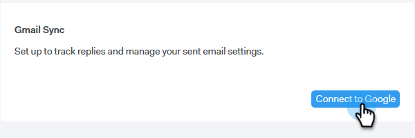
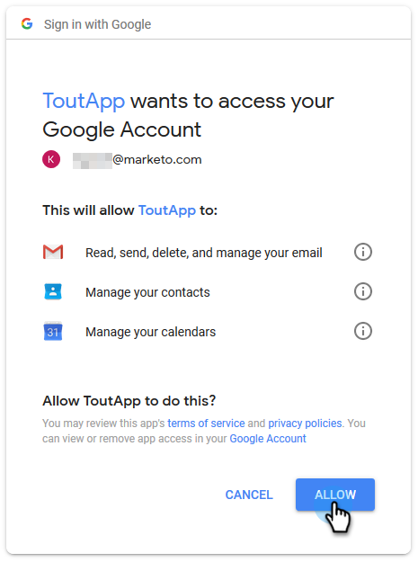

# Impostazione del canale di consegna {#setting-up-your-delivery-channel}

Quando iniziate a utilizzare Marketo Sales Connect, dovrete configurare un server SMTP per inviare le e-mail.

>[!NOTE]
>
>Oltre a configurare il server SMTP, è necessario verificare [l&#39;identità dell&#39;](http://docs.marketo.com/x/ewPh) e-mail prima di poter inviare le e-mail.

È possibile scegliere di inviare e-mail utilizzando un server SMTP personalizzato, un server SMTP Team o Gmail come canale di consegna. Passiamo a ogni opzione.

## SMTP personalizzato {#custom-smtp}

1. Accedete all’applicazione Web, fate clic sull’icona a forma di ingranaggio in alto a destra e scegliete **Impostazioni**.

   

1. In Account personale, fate clic su Impostazioni **e-** mail.

   

1. Selezionare Server **** SMTP.

   

1. Immettete le credenziali del server SMTP e fate clic su **Connect**.

   

   >[!NOTE]
   >
   >Se questo è il tuo unico canale di distribuzione, viene automaticamente assegnato a tutte le tue identità e-mail, e hai finito qui. Se questo non è l&#39;unico canale di consegna, continuate con il Passo 5.

1. In Impostazioni e-mail fare clic su **Indirizzo e firma**.

   

1. Individuate l&#39;identità e-mail per la quale desiderate scegliere un canale di consegna e fate clic su **Scegli canale** di consegna.

   

1. Nella scheda Consegne, fate clic su **Modifica**.

   

1. Fai clic sul menu a discesa Canale e scegli il canale di consegna personalizzato appena aggiunto. Fate clic su **Salva**.

   

   >[!NOTE]
   >
   >Se l&#39;amministratore del team configura il server SMTP del team, questo verrà applicato automaticamente solo all&#39;identità e-mail predefinita e sarà disponibile come opzione per le altre identità e-mail.

   **Video**`<iframe width="630" height="470" src="//play.vidyard.com/YWKSgZvBEjUU8FrXZ5hdYR.html?v=3.1.1" frameborder="0" allowfullscreen></iframe>`

## Server SMTP Team {#team-smtp-server}

>[!NOTE]
>
>**Autorizzazioni amministratore richieste**

1. Accedete all’applicazione Web, fate clic sull’icona a forma di ingranaggio in alto a destra e scegliete **Impostazioni**.

   

1. In Impostazioni amministratore, fai clic su Server SMTP **Team**.

   

1. Immettete le credenziali del server SMTP e fate clic su **Connect**.

   

   >[!NOTE]
   >
   >Il server SMTP del team sarà il canale di consegna predefinito dell&#39;identità e-mail predefinita per tutti i membri del team. Inoltre, sarà disponibile come opzione canale di consegna per tutte le altre identità e-mail.

   ** Guarda un video**`<iframe width="630" height="470" src="//play.vidyard.com/Ky9EwGmLcgvsMpFq3H8Y6n.html?v=3.1.1" frameborder="0" allowfullscreen></iframe>`

## Gmail {#gmail}

1. Accedete all’applicazione Web, fate clic sull’icona a forma di ingranaggio in alto a destra e scegliete **Impostazioni**.

   

1. In Account personale, fate clic su Impostazioni **e-** mail.

   

1. Fate clic su **Sincronizzazione** e-mail.

   

1. Fate clic su **Connetti a Google**.

   

1. Effettuate l&#39;accesso utilizzando le vostre credenziali Google.
1. Quando viene visualizzata questa schermata, fate clic su **Consenti**.

   

   >[!NOTE]
   >
   >Se questo è il tuo unico canale di distribuzione, viene automaticamente assegnato a tutte le tue identità e-mail, e hai finito qui. Se Gmail non è l&#39;unico canale di consegna, continuate a utilizzare il Passaggio 7.

1. Fare clic su **Indirizzo e firma**.

   

1. Fate clic sull’identità e-mail per la quale desiderate che Gmail sia il canale di consegna.

   

1. Quando il pannello delle diapositive si apre, scorrete verso il basso fino alla scheda di recapito.

   

1. Fai clic sul menu a discesa Canale e scegli il canale di consegna Gmail che hai appena aggiunto. Fate clic su **Salva**.

   

   >[!NOTE]
   >
   >Se l&#39;amministratore del team configura il server SMTP del team, questo verrà applicato automaticamente solo all&#39;identità e-mail predefinita e sarà disponibile come opzione per le altre identità e-mail.

