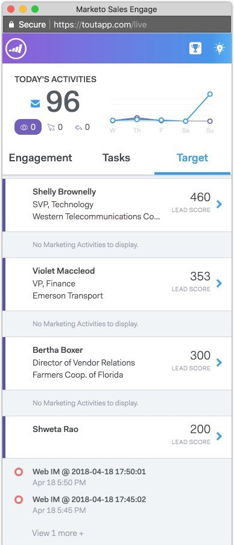

# Panoramica dei feed live {#live-feed-overview}

Live Feed è una finestra mobile che può essere avviata dall&#39;applicazione web o dal plug-in Gmail e offre un&#39;occhiata in tempo reale al potenziale coinvolgimento.

## Scheda Coinvolgimento {#engagement-tab}

Puoi vedere il coinvolgimento (visualizzazioni, clic e risposte) con le e-mail MSE in tempo reale.

Le persone contrassegnate con il viola coinvolgono i contenuti di marketing. Queste persone potrebbero non esistere in MSE. Puoi fare clic sulla freccia giù per aggiungerli e ottenere un elenco di altre azioni rapide.

Le persone contrassegnate da una linea blu rappresentano il coinvolgimento con le e-mail inviate tramite MSE.

>[!NOTE]
>
>Nel complesso, determiniamo le posizioni con la massima precisione possibile in base al tracciamento IP. Sfortunatamente, non è una scienza esatta. Se la posizione non è corretta per uno dei tuoi destinatari, ecco alcune opzioni su cosa potrebbe essere successo:
>
>* Se il destinatario ha effettuato l&#39;accesso alla rete wireless per un&#39;azienda che ha la sua sede centrale IT in un&#39;altra città o paese, registreremo tale posizione invece delle impostazioni internazionali correnti del destinatario.
>* Se l’e-mail è stata inoltrata o aperta da un utente nel campo CC/CCN, si tenta di visualizzare con precisione la posizione di tali persone.

## Scheda Attività {#tasks-tab}

Controlla rapidamente il tuo elenco da fare direttamente dal feed live.

Crea nuove attività o gestisci attività aperte.

Filtra oggi, domani, oggi *e* domani o 7 giorni.

>[!NOTE]
>
>Non puoi utilizzare il filtro data personalizzato nel feed live, ma puoi farlo nell&#39;applicazione web.

Utilizza i pulsanti di azione rapida per effettuare rapidamente una chiamata, inviare un’e-mail o passare al profilo Linkedin di una persona.

## Scheda Target {#target-tab}

Puoi vedere le persone migliori (ordinate dal più alto al più basso) in base al punteggio del lead. Il punteggio iniziale viene estratto dall’istanza Marketo.

* I lead verranno generati quando il punteggio della persona aumenta in Marketo.
* Mostriamo i primi 50 lead.
* Vedrete solo le persone che vi sono state assegnate in Salesforce.

## Icona Glossario {#icon-glossary}

<table> 
 <colgroup> 
  <col> 
  <col> 
 </colgroup> 
 <tbody> 
  <tr> 
   <td> 
    
 
     

 
    
</td> 
   <td>
Qualcuno ha visualizzato il messaggio e-mail
</td> 
  </tr> 
  <tr> 
   <td> 
    
 
     

 
    
</td> 
   <td>
Qualcuno ha fatto clic su un collegamento nell'e-mail
</td> 
  </tr> 
  <tr> 
   <td> 
    
 
     

 
    
</td> 
   <td>
Qualcuno ha risposto alla tua e-mail
</td> 
  </tr> 
  <tr> 
   <td colspan="1"> 
    
 
     

 
    
</td> 
   <td colspan="1">Qualsiasi notifica elencata in Momenti di interesse, inclusi E-mail, Web e Milestone</td> 
  </tr> 
 </tbody> 
</table>

>[!NOTE]
>
>Se vedi qualcuno che visualizza l’e-mail più e più volte nel tuo feed live, potrebbe aver inoltrato l’e-mail ad altri destinatari. Questo è molto probabilmente il caso se noti che la posizione inizia a cambiare per quelle visualizzazioni.
