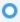

# Panoramica sui feed live {#live-feed-overview}

Il Feed dal vivo è una finestra mobile che può essere avviata dall&#39;applicazione Web o dal plug-in Gmail e offre un&#39;analisi in tempo reale del potenziale di coinvolgimento.

## Scheda Engagement {#engagement-tab}

Puoi vedere il coinvolgimento (visualizzazioni, clic e risposte) nelle e-mail MSE in tempo reale.

Le persone contrassegnate con il viola interagiscono con i contenuti di marketing. Queste persone potrebbero non esistere in MSE. Potete fare clic sulla freccia rivolta verso il basso per aggiungerle e ottenere un elenco di altre azioni rapide.

Le persone contrassegnate da una linea blu rappresentano il coinvolgimento con le e-mail inviate tramite MSE.

>[!NOTE]
>
>In generale, determiniamo le posizioni con la massima precisione possibile in base al tracciamento IP. Sfortunatamente, non è una scienza esatta. Se la posizione non è corretta per uno dei destinatari, ecco un paio di opzioni per ciò che potrebbe essere successo:
>
>* Se il destinatario ha eseguito l&#39;accesso alla rete wireless per un&#39;azienda che ha la propria sede centrale in un&#39;altra città o in un altro paese, registreremmo tale posizione invece delle impostazioni internazionali correnti del destinatario.
>* Se l&#39;e-mail è stata inoltrata o aperta da un utente nel campo CC/CCN, si tenta di visualizzare con precisione la posizione di tali persone.

## Scheda Attività {#tasks-tab}

Controlla rapidamente l&#39;elenco da fare direttamente da Live Feed.

Creare nuove attività o gestire attività aperte.

Filtrare oggi, domani, oggi *e* domani o nei prossimi 7 giorni.

>[!NOTE]
>
>Non potete utilizzare il filtro di data personalizzato nei feed dinamici, ma potete farlo nell&#39;applicazione Web.

Utilizza i pulsanti di azione rapida per effettuare rapidamente una chiamata, inviare un messaggio e-mail o passare al profilo di Linkedin di una persona.

## Scheda Target {#target-tab}

Visualizzare le persone migliori (ordinate dal più alto al più basso) classificate in base al punteggio iniziale. Il punteggio iniziale viene estratto dall’istanza di Marketo.

* I lead verranno generati quando il loro punteggio personale aumenta in Marketo.
* Mostriamo i primi 50 lead.
* Vedrai solo le persone che ti sono state assegnate in Salesforce.

## Glossario icona {#icon-glossary}

<table> 
 <colgroup> 
  <col> 
  <col> 
 </colgroup> 
 <tbody> 
  <tr> 
   <td> 
    
 
     

 
    
</td> 
   <td>
Qualcuno ha visualizzato il messaggio e-mail
</td> 
  </tr> 
  <tr> 
   <td> 
    
 
     

 
    
</td> 
   <td>
Qualcuno ha fatto clic su un collegamento nel messaggio e-mail
</td> 
  </tr> 
  <tr> 
   <td> 
    
 
     

 
    
</td> 
   <td>
Qualcuno ha risposto alla vostra e-mail
</td> 
  </tr> 
  <tr> 
   <td colspan="1"> 
    
 
     

 
    
</td> 
   <td colspan="1">Qualsiasi notifica elencata in Momenti interessanti, inclusi E-mail, Web e pietre miliari</td> 
  </tr> 
 </tbody> 
</table>

>[!NOTE]
>
>Se qualcuno visualizza ripetutamente il messaggio e-mail nel feed dal vivo, potrebbe averlo inoltrato ad altri destinatari. Questo è molto probabile se notate che la posizione inizia a cambiare per quelle viste.
