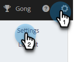

# Aggiungi automaticamente l’impostazione del messaggio di annullamento dell’iscrizione {#auto-append-unsubscribe-message-setting}

Assicurati che ogni e-mail inviata includa un messaggio per annullare l’iscrizione in modo che i destinatari abbiano una facile opzione per rinunciare alle comunicazioni. Quando è abilitato il messaggio di annullamento dell’iscrizione accodamento, tutte le comunicazioni inviate dal team da Marketo Sales includeranno un messaggio di annullamento dell’iscrizione, incluse le e-mail inviate dall’applicazione web, Salesforce, il plug-in Gmail e il plug-in di Outlook.

## Aspetti da considerare {#things-to-note}

* Per le e-mail inviate dai plug-in, l’annullamento dell’abbonamento verrà aggiunto solo quando viene utilizzato un modello.

* Se si utilizza il campo dinamico `{{team_unsubscribe}}` in un modello di messaggio di posta elettronica e l&#39;impostazione di accodamento del messaggio di annullamento dell&#39;iscrizione è abilitata, il campo dinamico di annullamento dell&#39;iscrizione del team popolerà il messaggio di annullamento dell&#39;iscrizione _anziché_ accodando il messaggio di annullamento dell&#39;iscrizione.

## Abilita/Disabilita annulla iscrizione accodamento {#enable-disable-unsubscribe-append}

1. Fai clic sull&#39;icona a forma di ingranaggio e seleziona **Impostazioni**.

   

1. In Impostazioni Amministrazione Fare Clic Su **Annulla Sottoscrizione**.

   

1. Nella scheda Messaggistica, in Aggiungi messaggio di annullamento iscrizione, sposta il dispositivo di scorrimento sullo stato desiderato.

   

>[!TIP]
>
>Se disattivi l’impostazione di aggiunta del messaggio di annullamento dell’iscrizione, ti consigliamo di aggiungere ai modelli un piè di pagina di annullamento dell’iscrizione per garantire che la comunicazione disponga di un’opzione di rinuncia. Per eseguire questa operazione, aggiungere un messaggio personalizzato a ogni modello oppure utilizzare il `{{team_unsubscribe}}` [campo dinamico](/help/marketo/product-docs/marketo-sales-connect/templates/dynamic-fields/dynamic-fields-glossary.md){target="_blank"}.
