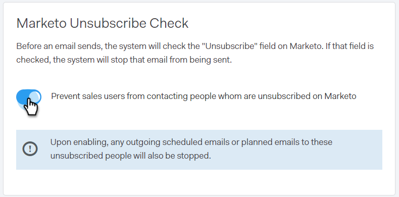

# Verifica annullamento iscrizione Marketo {#marketo-unsubscribe-check}

Il controllo per annullare l’abbonamento a Marketo utilizza la connessione del tuo team a Marketo per impedire che le e-mail arrivino a persone non abbonate nel sistema di gestione dei lead di Marketo. Quando un utente di vendita invia un’e-mail con Sales Connect, viene effettuata una chiamata API a Marketo per verificare se l’ID e-mail non è abbonato. In caso affermativo, l’e-mail non verrà inviata.

>[!NOTE]
>
>**Autorizzazioni amministratore richieste**

## Attivazione {#turning-it-on}

1. Nell’applicazione web, fai clic sull’icona a forma di ingranaggio e seleziona **Impostazioni**.

   

1. In Impostazioni amministrazione, fai clic su **Annulla iscrizione**.

   

1. Clic **Integrazioni**.

   

1. Nella sezione Marketo Unsubscribe Check, fai clic sul cursore per attivare il controllo.

   

## Aspetti da considerare {#things-to-know}

Controllo per annullare l’abbonamento a Marketo...

* Non viene conteggiato rispetto ai limiti API
* Richiede la connessione a Marketo
* È un’impostazione globale
* Blocca le e-mail inviate dall’applicazione web, dai client e-mail e da Salesforce
* Registra un’e-mail non riuscita o impedisce a un utente di inviare quando tenta di inviare per tutti i flussi di lavoro (invio del plug-in e-mail, invio individuale, invio della campagna di vendita, selezione e invio multipli) ad eccezione di [raggruppa e-mail](/help/marketo/product-docs/marketo-sales-connect/email/using-the-compose-window/composing-bulk-emails-with-select-and-send.md), in cui impediremo l’invio silenzioso delle e-mail
