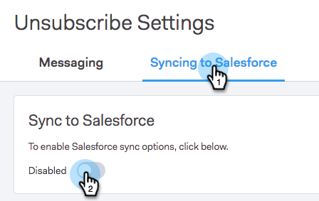

# Sincronizzazione delle sottoscrizioni con Salesforce {#syncing-unsubscribes-with-salesforce}

## Requisiti per la sincronizzazione di Annulla sottoscrizione a Salesforce {#requirements-for-unsubscribes-to-sync-to-salesforce}

* La sincronizzazione dell&#39;annullamento della sottoscrizione deve essere abilitata (per la sincronizzazione notturna)
* Il campo Rifiuto deve essere installato in Salesforce
* I record delle persone in Sales Connect devono avere un ID Salesforce

**Annulla sottoscrizione push**

Quando viene raccolto un annullamento della sottoscrizione in Sales Connect, lo inviamo in tempo reale a Salesforce e aggiornate uno dei campi di rifiuto selezionati per la sincronizzazione. Se hai disabilitato la sincronizzazione di Salesforce, l&#39;annullamento della sottoscrizione verrà comunque inoltrato all&#39;e-mail di rifiuto.

**Annulla sottoscrizione sincronizzazione**

Dopo aver attivato la sincronizzazione dell’annullamento della sottoscrizione (passaggio 3 qui sotto), verrà attivata la sincronizzazione notturna. La sincronizzazione avviene una volta al giorno intorno alle 20:00 PST. Sincronizzerà bidirezionalmente tutti gli utenti senza sottoscrizione in MSE/ToutApp con il campo Rifiuto in Salesforce.

## Configurare Annulla sottoscrizione sincronizzazione su Salesforce {#configure-unsubscribe-sync-to-salesforce}

Gli utenti possono decidere se desiderano sincronizzare le proprie iscrizioni con il campo Rifiuto e-mail standard con cui Marketo può anche eseguire la sincronizzazione, oppure possono sincronizzarsi con il campo Rifiuto vendite Marketo in modo che gli abbonamenti alle vendite e gli annulli di marketing possano essere differenziati.

1. Accedete all&#39; [applicazione Web](https://toutapp.com/login), fate clic sull&#39;icona a forma di ingranaggio e selezionate **Impostazioni**.

   

1. In Impostazioni amministratore, seleziona **Annulla sottoscrizione**.

   

1. Fate clic su **Sincronizzazione su Salesforce**, quindi abilitate la sincronizzazione notturna.

   

1. Selezionate il campo da sincronizzare.

   

   | Field | Descrizione |
   |---|---|
   | **Sincronizzazione con il campo Rifiuto Salesforce** | Selezionato per impostazione predefinita, aggiorna solo il campo Rifiuto Salesforce. |
   | **Campo Sincr. su Vendita Marketo** | Se desiderate separare le sottoscrizioni Vendite e Marketing, scegliete questa opzione per aggiornare il campo aggiuntivo [Rinuncia alle vendite marketing.](#msoo) |

## Installazione del campo Rifiuto nel layout di pagina {#installing-the-opt-out-field-in-the-page-layout}

**Rifiuto e-mail**

Rifiuto e-mail è un campo standard di Salesforce che può essere installato da Salesforce. Devi essere un amministratore Salesforce per installarlo.

1. Vai a [Salesforce.com](https://salesforce.com) ed effettua l&#39;accesso.

   

1. Fare clic sul nome utente e selezionare **Setup**.

   

1. Nella casella di ricerca rapida, cercate Contatto o Lead. In questo scenario stiamo installando il campo nel layout della pagina Contatti, ma si desidera installare per entrambi i record di persona.

   

1. Selezionare **Layout di pagina**.

   

1. Selezionare **Edit** accanto al layout della pagina a cui si desidera aggiungere il campo.

   

1. Selezionare **Campi**.

   

1. Trascinate e rilasciate Rifiuto e-mail nel layout della pagina.

   

1. Fare clic su **Salva**.

   

## Rinuncia alle vendite di Marketo {#marketo-sales-opt-out}

Il campo Rifiuto vendite Marketo è un campo personalizzato disponibile per gli utenti che hanno installato le Personalizzazioni di Marketing Connect.

Dopo aver installato con successo le personalizzazioni di Marketo Sales Connect in Salesforce, visualizzerete il campo Rinuncia alle vendite di Marketo.
