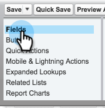

# Sincronizzazione degli annullamenti di abbonamenti con Salesforce {#syncing-unsubscribes-with-salesforce}

## Requisiti per annullare l’abbonamento a Sync to Salesforce {#requirements-for-unsubscribes-to-sync-to-salesforce}

* La sincronizzazione degli annullamenti dell’abbonamento deve essere abilitata (per la sincronizzazione notturna)
* Il campo Opt Out deve essere installato in Salesforce
* I record della persona in Sales Connect devono avere un ID Salesforce

**Annullamenti iscrizione push**

Quando un annullamento dell’iscrizione viene raccolto in Sales Connect, viene inviato a Salesforce in tempo reale e viene aggiornato uno dei campi di rinuncia selezionati per la sincronizzazione con. Se hai disattivato la sincronizzazione con Salesforce, invieremo comunque l’annullamento dell’iscrizione alla rinuncia all’e-mail.

**Sincronizzazione per annullamento iscrizione**

Dopo aver attivato la sincronizzazione per l’annullamento dell’abbonamento (passaggio 3 di seguito), verrà attivata la sincronizzazione notturna. La sincronizzazione viene eseguita una volta al giorno intorno alle 20:00 PST. Sincronizzerà bidirezionalmente tutti gli annullamenti di abbonamenti in Marketo Sales con il campo Opt Out in Salesforce.

## Configurare la sincronizzazione degli annullamenti dell’abbonamento con Salesforce {#configure-unsubscribe-sync-to-salesforce}

Gli utenti possono decidere se sincronizzare gli annullamenti degli abbonamenti con il campo standard Email Opt Out (Rinuncia e-mail) con cui può sincronizzarsi Marketo, oppure con il campo Marketo Sales Opt Out (Rinuncia alle vendite) in modo da poter distinguere gli annullamenti degli abbonamenti alle vendite e agli marketing.

1. Vai a [applicazione web](https://toutapp.com/login), fai clic sull’icona a forma di ingranaggio e seleziona **Impostazioni**.

   

1. In Impostazioni amministratore seleziona **Annulla iscrizione**.

   

1. Clic **Sincronizzazione con Salesforce**, quindi attiva la sincronizzazione notturna.

   

1. Seleziona il campo a cui desideri sincronizzare.

   

   | Campo | Descrizione |
   |---|---|
   | **Sincronizza con il campo di rinuncia Salesforce** | Selezionata per impostazione predefinita, aggiorna solo il campo Rinuncia Salesforce. |
   | **Sincronizza con il campo Marketo Sales Opt Out** | Se si desidera separare gli annullamenti degli abbonamenti alle vendite e al marketing, scegliere questa opzione per aggiornare ulteriori [Campo Rinuncia vendite Marketo.](#msoo) |

## Installazione del campo Rinuncia nel layout di pagina {#installing-the-opt-out-field-in-the-page-layout}

**Rinuncia e-mail**

Rinuncia e-mail è un campo standard in Salesforce disponibile per l’installazione da Salesforce. Per installarlo, devi essere un amministratore Salesforce.

1. Vai a [Salesforce.com](https://salesforce.com) e accedi.

   

1. Fai clic sul nome utente e seleziona **Configurazione**.

   

1. Nella casella di ricerca rapida cercare Contatto o Lead. In questo caso, il campo verrà installato nel layout della pagina Contatto, ma sarà necessario eseguire l&#39;installazione per entrambi i record persona.

   

1. Seleziona **Layout di pagina**.

   

1. Seleziona **Modifica** accanto al layout di pagina a cui si desidera aggiungere il campo.

   

1. Seleziona **Campi**.

   

1. Trascina e rilascia la rinuncia e-mail nel layout della pagina.

   

1. Clic **Salva**.

   

## Rinuncia alle vendite Marketo {#marketo-sales-opt-out}

Il campo Rinuncia vendite Marketo è un campo personalizzato disponibile per gli utenti che hanno installato Personalizzazioni di Marketo Sales Connect.

Dopo aver installato correttamente le personalizzazioni di Marketo Sales Connect in Salesforce, verrà visualizzato il campo Marketo Sales Opt Out disponibile.
