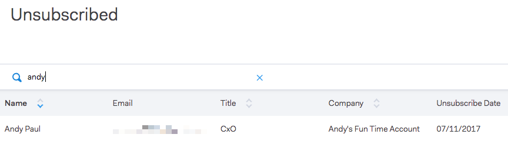

# Annullare la sottoscrizione del gruppo {#unsubscribe-group}

Visualizza e gestisci tutte le persone non iscritte in un&#39;unica posizione.

Utilizza la barra di ricerca per cercare le persone non iscritte.

Se sei un amministratore, puoi passare al gruppo di annullamento dell&#39;iscrizione per filtrare in base a [!UICONTROL Account Unsubscribes] e visualizzare tutti gli annullamenti dell&#39;iscrizione raccolti nel database delle persone.

