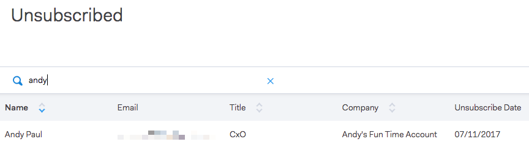

# Annulla sottoscrizione gruppo {#unsubscribe-group}

Visualizza e gestisci tutte le persone non iscritte in un&#39;unica posizione.

Utilizza la barra di ricerca per cercare le persone non iscritte.

Se sei un amministratore, puoi passare al gruppo di annullamento dell’abbonamento per filtrare in base agli annullamenti dell’abbonamento all’account e visualizzare tutti gli annullamenti dell’abbonamento raccolti nel database delle persone.

