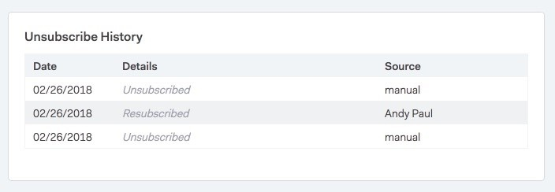

# Scheda Cronologia per annullare l’iscrizione {#unsubscribe-history-card}

La scheda Cronologia Annulla iscrizione consente agli amministratori e agli utenti di ottenere informazioni contestuali sulla cronologia degli annullamenti dell’abbonamento dei loro contatti.

>[!NOTE]
>
>Per arrivare qui, fai clic sulla scheda Persone e seleziona una persona. Si trova nella parte inferiore della scheda Informazioni nella visualizzazione Dettagli persona (se l’iscrizione è stata annullata).

<table> 
 <colgroup> 
  <col> 
  <col> 
 </colgroup> 
 <tbody> 
  <tr> 
   <td><strong>Data</strong></td> 
   <td>
Mostra la data in cui si è verificato l’annullamento/il reabbonamento.
</td> 
  </tr> 
  <tr> 
   <td><strong>Dettagli</strong></td> 
   <td>
Risottosci: un amministratore di Sales Connect ha rimosso manualmente l'annullamento dell'abbonamento dal record del contatto. Potrebbero inoltre essere visualizzati alcuni dettagli relativi al motivo per cui il contatto ha annullato l’abbonamento.

Annulla iscrizione: il contatto ha annullato l’iscrizione.
</td> 
  </tr> 
  <tr> 
   <td><strong>Origine</strong></td> 
   <td>
Salesforce Sync: l’annullamento dell’abbonamento è stato acquisito da una sincronizzazione di Salesforce.

Manuale: l’utente ha fatto clic sul pulsante per annullare l’abbonamento e rinunciare.

Collegamento selezionato: il destinatario di un’e-mail ha fatto clic sul collegamento per annullare l’abbonamento.

"Admin Name" (Nome amministratore): il nome di un amministratore viene visualizzato quando l’azione consisteva nel riabbonare i contatti. In questo modo gli utenti possono sapere chi ha rimosso l’annullamento dell’abbonamento.
</td> 
  </tr> 
 </tbody> 
</table>
