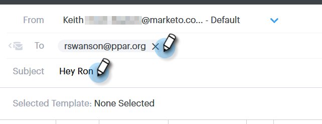

# Aggiungere un allegato o un contenuto tracciabile all’e-mail {#add-an-attachment-or-trackable-content-to-your-email}

Quando si invia un&#39;e-mail tramite Sales Connect, è possibile aggiungere un file come allegato o rendere un file scaricabile (e tracciabile).

>[!NOTE]
>
>In genere, qualsiasi file superiore a 20 MB è troppo grande per essere consegnato. La dimensione di un allegato che puoi inviare tramite e-mail varia a seconda del canale di consegna e-mail in uso.

## Aggiungi un allegato {#add-an-attachment}

1. Crea la bozza dell’e-mail (esistono diversi modi per farlo, in questo esempio che stiamo scegliendo **Componi** nell’intestazione).

   

1. Compilare il campo A e immettere un oggetto.

   

1. Fare clic sull&#39;icona dell&#39;allegato.

   

1. Selezionare il file da allegare e fare clic su **Inserisci**.

   

   >[!NOTE]
   >
   >Se devi caricare un file, fai clic su **Carica contenuto** in alto a destra.

   

L’allegato viene visualizzato nella parte inferiore dell’e-mail.

## Aggiungi contenuto tracciabile {#add-trackable-content}

1. Crea la bozza dell’e-mail (esistono diversi modi per farlo; in questo esempio stiamo scegliendo la finestra Componi).

   

1. Compilare il campo A e immettere un oggetto.

   

1. Fai clic sul punto dell’e-mail in cui desideri visualizzare il contenuto tracciabile, quindi fai clic sull’icona dell’allegato.

   

1. Seleziona il contenuto da aggiungere, fai clic su **Il contenuto è tracciato** e fare clic su **Inserisci**.

   

   >[!NOTE]
   >
   >Se devi caricare un file, fai clic su **Carica contenuto** in alto a destra.

   Il contenuto viene visualizzato come collegamento nell’e-mail. Il destinatario può fare clic sul collegamento per scaricare il contenuto.

   

   >[!NOTE]
   >
   >Gli utenti riceveranno una notifica nel feed live quando le persone visualizzano i propri contenuti tracciati. Gli utenti possono inoltre visualizzare i contenuti con le prestazioni più elevate nella sezione dei contenuti della pagina Analytics.
