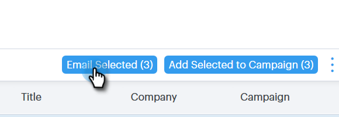

# Composizione di e-mail in blocco con Seleziona e invia {#composing-bulk-emails-with-select-and-send}

Di seguito viene illustrato come inviare/modificare e-mail utilizzando l&#39;opzione Seleziona e invia.

## Invio di e-mail {#sending-emails}

1. Passate alla pagina Persone.

   

1. Selezionate le persone da inviare tramite e-mail.

   

   >[!NOTE]
   >
   >È possibile selezionare fino a 200 persone quando si utilizza Seleziona e invia.

1. Fare clic sul pulsante **E-mail selezionata**.

   

1. Inserite un oggetto, selezionate un modello (o componete l&#39;e-mail da zero) e inviate/[pianificazione](/help/marketo/product-docs/marketo-sales-connect/email/using-the-compose-window/scheduling-an-email.md) l&#39;e-mail.

   

   >[!NOTE]
   >
   >Se avete selezionato un modello e desiderate verificare che tutti i campi dinamici siano stati compilati correttamente prima dell&#39;invio, fate clic su **Anteprima campi dinamici**. Verificate che tutti i destinatari nella barra laterale siano selezionati per visualizzare l&#39;anteprima di tutti i messaggi e-mail. Se si seleziona un&#39;e-mail e si fa clic su **Anteprima campi dinamici**, verrà visualizzata l&#39;anteprima solo dell&#39;e-mail.

## Modifica di e-mail {#editing-emails}

**Modifiche collettive**

1. Seguire i passaggi da 1 a 3 dalla sezione [Invio di e-mail](#sending-emails).

   >[!NOTE]
   >
   >Tutti i destinatari verranno selezionati per impostazione predefinita. Se fate clic su un singolo e desiderate selezionare di nuovo tutti, fate clic su **Tutti i destinatari**. Come promemoria, è necessario selezionare tutti i destinatari per apportare modifiche collettive.

1. Apportate le modifiche nell’editor. Potete creare un nuovo messaggio e-mail o modificare un modello (in questo esempio stiamo creando un nuovo messaggio e-mail).

   

   >[!NOTE]
   >
   >Potete fare clic su un destinatario e-mail specifico per visualizzare le modifiche propagate a tale e-mail.

1. Fare clic su **Invia** (o [Pianificazione](/help/marketo/product-docs/marketo-sales-connect/email/using-the-compose-window/scheduling-an-email.md)) per inviare a tutti i destinatari gli aggiornamenti e-mail eseguiti in massa.

   

**Modifica ogni e-mail**

Completate gli aggiornamenti in blocco prima di personalizzare ogni e-mail, poiché con un aggiornamento in blocco le modifiche apportate a ogni e-mail presente nella barra laterale della composizione in massa vengono sovrascritte.

1. Seguite i passaggi da 1 a 4 della sezione [Invio di e-mail](#sending-emails).

   >[!NOTE]
   >
   >Tutti i destinatari verranno selezionati per impostazione predefinita. Se fate clic su un singolo e desiderate selezionare di nuovo tutti, fate clic su **Tutti i destinatari**. Come promemoria, è necessario selezionare tutti i destinatari per apportare modifiche collettive.

1. Seleziona un singolo destinatario.

   

1. Apportate le modifiche nell’editor.

   

   >[!NOTE]
   >
   >È in questo punto che è possibile apportare modifiche a un&#39;unica e-mail nella barra laterale principale senza aggiornare le altre e-mail.

   >[!TIP]
   >
   >È possibile fare clic su altri destinatari per verificare che le modifiche apportate al destinatario selezionato in precedenza non siano visibili.

1. Fare clic su **Invia** (o [Pianificazione](/help/marketo/product-docs/marketo-sales-connect/email/using-the-compose-window/scheduling-an-email.md)) per inviare a tutti i destinatari gli aggiornamenti e-mail eseguiti in massa.

   

   >[!MORELIKETHIS]
   >
   >* [Opzioni di invio in blocco](/help/marketo/product-docs/marketo-sales-connect/email/using-the-compose-window/bulk-sending-options.md)
   >* [Utilizzo di un modello nella finestra Componi](/help/marketo/product-docs/marketo-sales-connect/email/using-the-compose-window/using-a-template-in-the-compose-window.md)
   >* [Campi dinamici](/help/marketo/product-docs/marketo-sales-connect/templates/dynamic-fields/how-to-insert-dynamic-fields.md)

