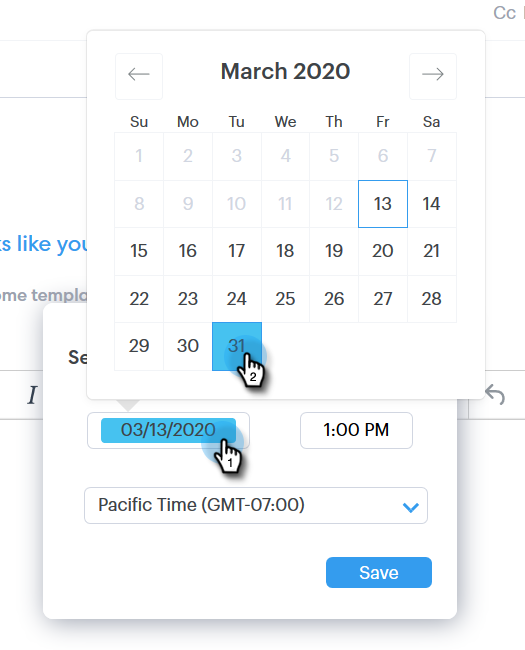

# Pianificazione di un’e-mail {#scheduling-an-email}

Segui questi semplici passaggi per pianificare un’e-mail.

>[!NOTE]
>
>Per aggiornare il fuso orario predefinito, vai alla pagina Impostazioni .

1. Crea la bozza dell’e-mail (esistono diversi modi per farlo, in questo esempio stiamo scegliendo **Componi** nell’intestazione).

   

1. Al termine della composizione dell’e-mail, fai clic su **Pianificazione** in basso a destra

   

1. Fai clic sulla data per aprire il selettore data e selezionare una data.

   

1. Immetti l’ora in cui desideri che l’e-mail venga inviata. Seleziona il fuso orario desiderato e fai clic su **Salva**. Al termine, chiudi la pianificazione.

   

1. Dopo aver selezionato la data/ora pianificata, fai clic su **Invia** per pianificare l’e-mail.

   

   >[!NOTE]
   >
   >Le e-mail pianificate possono essere visualizzate/modificate nella sezione delle cartelle pianificate del Centro comandi.

   >[!MORELIKETHIS]
   >
   >[Panoramica del centro comandi](/help/marketo/product-docs/marketo-sales-connect/email/command-center/command-center-overview.md)
