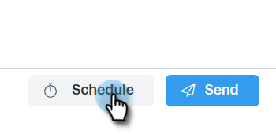
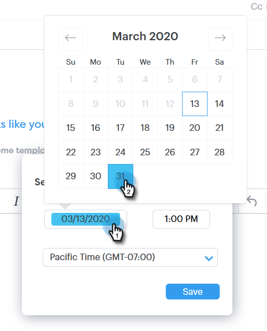
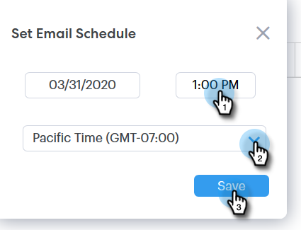
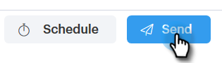

# Programmazione di un’e-mail {#scheduling-an-email}

Segui questi semplici passaggi per pianificare un’e-mail.

>[!NOTE]
>
>Per aggiornare il fuso orario predefinito, vai alla pagina Impostazioni.

1. Crea la bozza dell&#39;e-mail (esistono diversi modi per farlo, in questo esempio stiamo scegliendo **[!UICONTROL Compose]** nell&#39;intestazione).

   

1. Al termine della composizione dell&#39;e-mail, fai clic su **[!UICONTROL Schedule]** in basso a destra

   

1. Fai clic sulla data per aprire il selettore data e seleziona una data.

   

1. Immetti l’ora in cui desideri che l’e-mail venga inviata. Selezionare il fuso orario desiderato e fare clic su **[!UICONTROL Save]**. Al termine, chiudi la pianificazione.

   

1. Dopo aver selezionato la data/ora pianificata, fare clic su **[!UICONTROL Send]** per pianificare l&#39;e-mail.

   

   >[!NOTE]
   >
   >Le e-mail pianificate possono essere visualizzate/modificate nella sezione cartelle pianificate del Centro comandi.

   >[!MORELIKETHIS]
   >
   >[Panoramica del centro comandi](/help/marketo/product-docs/marketo-sales-connect/email/command-center/command-center-overview.md)
