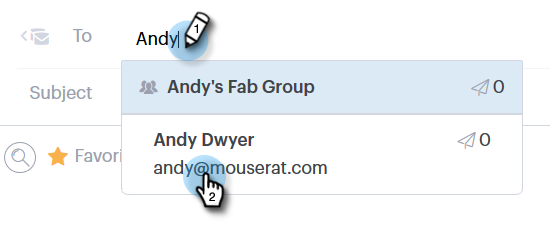

# Invio di un&#39;e-mail tracciata {#sending-a-tracked-email}

Durante l’invio di un’e-mail con Marketo Sales Connect, verranno monitorate le visualizzazioni (aperture delle e-mail) e i clic (clic sui collegamenti).

>[!PREREQUISITES]
>
>Prima di inviare un’e-mail tracciata, dovrai verificare l’identità e impostare un canale di consegna e-mail.
>
>* [Verifica l&#39;indirizzo e-mail](/help/marketo/product-docs/marketo-sales-connect/getting-started/email-settings/verify-your-email.md)
>* Imposta un canale di consegna per [Outlook](/help/marketo/product-docs/marketo-sales-connect/email-plugins/msc-for-outlook/email-connection-for-outlook-users.md) o [Gmail](/help/marketo/product-docs/marketo-sales-connect/email-plugins/gmail/email-connection-for-gmail-users.md)

1. Crea la bozza dell&#39;e-mail (ci sono diversi modi per farlo, in questo esempio scegliamo **Componi** nell&#39;intestazione).

   

1. Immetti il nome o l&#39;e-mail di un destinatario nel campo **A** .

   

   >[!NOTE]
   >
   >Nel campo A è possibile avere una sola persona.

1. Aggiungi tutti i destinatari da Cc o Ccn nei rispettivi campi.

   

   >[!NOTE]
   >
   >Se qualcuno che è stato CC-d o Ccn apre l’e-mail, questa verrà registrata come visualizzazione nel record della persona nel campo **To** .

1. Aggiungi un oggetto.

   

   >[!NOTE]
   >
   >Per inviare l’e-mail è necessario specificare l’oggetto e il destinatario. Dopo l’aggiunta dell’oggetto e del destinatario, **salveremo automaticamente la bozza**.

1. Componi il tuo messaggio e-mail utilizzando l’editor. Al termine, fai clic su **Invia** (o [Pianifica](/help/marketo/product-docs/marketo-sales-connect/email/using-the-compose-window/scheduling-an-email.md), se lo desideri).

   

   >[!MORELIKETHIS]
   >
   >* [Pianificazione di un’e-mail](/help/marketo/product-docs/marketo-sales-connect/email/using-the-compose-window/scheduling-an-email.md)
   >* [Modelli](/help/marketo/product-docs/marketo-sales-connect/templates/create-a-new-template.md)

