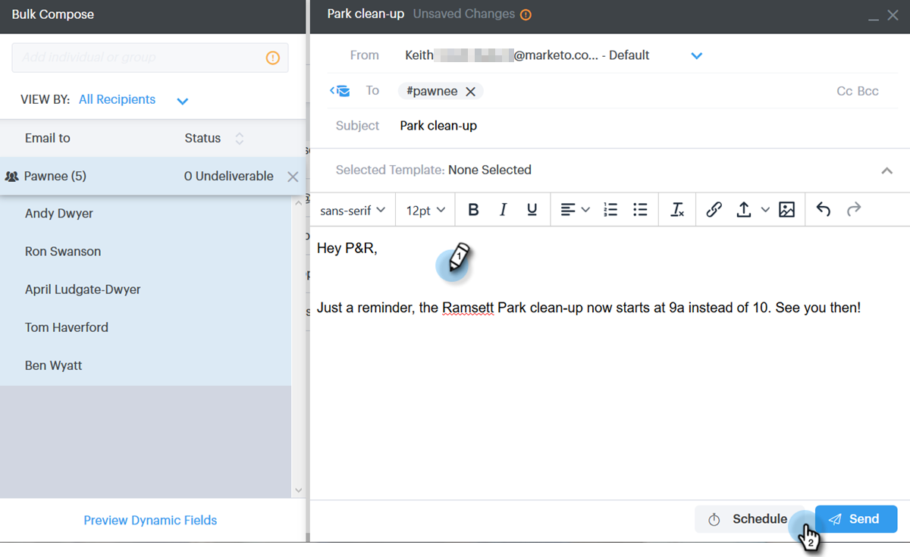

# Invio di e-mail tramite e-mail di gruppo {#sending-emails-via-group-email}

Ecco come inviare/modificare le e-mail utilizzando l’opzione Raggruppa e-mail.

## Invio di un’e-mail di gruppo {#sending-a-group-email}

1. Fai clic sulla scheda **[!UICONTROL People]**.

   

1. Seleziona il gruppo a cui desideri inviare l’e-mail.

   

1. Fare clic sul pulsante [!UICONTROL Group Actions] e selezionare **[!UICONTROL Email Group]**.

   

1. Compila il messaggio e-mail (o seleziona un modello) e invialo (o pianificalo).

   

## Modifica di un’e-mail di gruppo {#editing-a-group-email}

1. Crea un&#39;e-mail di gruppo utilizzando [i passaggi 1-3 sopra](#sending-a-group-email).

1. Scegli un modello o compila il tuo messaggio e-mail.

   

1. Al termine dell’e-mail, ora puoi visualizzare in anteprima ogni e-mail nell’elenco per verificare se i campi dinamici si stanno popolando correttamente.

   

1. Seleziona il destinatario desiderato.

   

1. Fare clic su **[!UICONTROL Preview Dynamic Fields]** e visualizzare l&#39;anteprima a destra.

   

   >[!NOTE]
   >
   >Puoi apportare modifiche in blocco all’e-mail/modello quando invii un’e-mail di gruppo, ma non puoi apportare modifiche univoche per destinatari specifici nell’elenco.

>[!MORELIKETHIS]
>
>* [Opzioni di invio in blocco](/help/marketo/product-docs/marketo-sales-connect/email/using-the-compose-window/bulk-sending-options.md)
>* [Utilizzo di un modello nella finestra di composizione](/help/marketo/product-docs/marketo-sales-connect/email/using-the-compose-window/using-a-template-in-the-compose-window.md)
