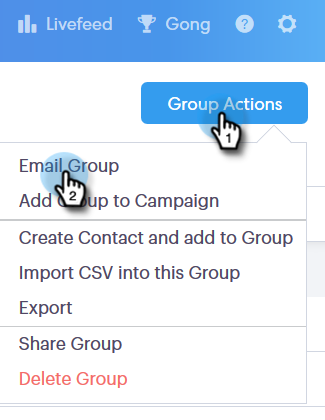

# Invio di e-mail tramite e-mail di gruppo {#sending-emails-via-group-email}

Ecco come inviare/modificare le e-mail utilizzando l’opzione Raggruppa e-mail .

## Invio di un’e-mail di gruppo {#sending-a-group-email}

1. Fai clic sul pulsante **Persone** scheda .

   

1. Seleziona il gruppo da inviare tramite e-mail.

   

1. Fare clic sul pulsante Raggruppa azioni e selezionare **Gruppo e-mail**.

   

1. Compila il tuo messaggio e-mail (o seleziona un modello) e invialo (o pianificalo).

   

## Modifica di un messaggio e-mail di gruppo {#editing-a-group-email}

1. Creare un messaggio e-mail di gruppo utilizzando [Passaggi da 1 a 3](#sending-a-group-email).

1. Scegli un modello o compila il tuo messaggio e-mail.

   

1. Al termine dell’e-mail, ora puoi visualizzare in anteprima ogni e-mail nell’elenco per verificare se i campi dinamici si stanno popolando correttamente.

   

1. Seleziona il destinatario desiderato.

   

1. Fai clic su **Anteprima campi dinamici** e visualizza l&#39;anteprima a destra.

   

   >[!NOTE]
   >
   >Puoi apportare modifiche in blocco all’e-mail o al modello quando invii un’e-mail di gruppo, ma non puoi apportare modifiche univoche per destinatari specifici nell’elenco.

>[!MORELIKETHIS]
>
>* [Opzioni di invio in blocco](/help/marketo/product-docs/marketo-sales-connect/email/using-the-compose-window/bulk-sending-options.md)
>* [Utilizzo di un modello nella finestra Componi](/help/marketo/product-docs/marketo-sales-connect/email/using-the-compose-window/using-a-template-in-the-compose-window.md)

