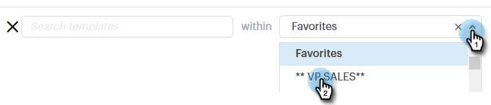
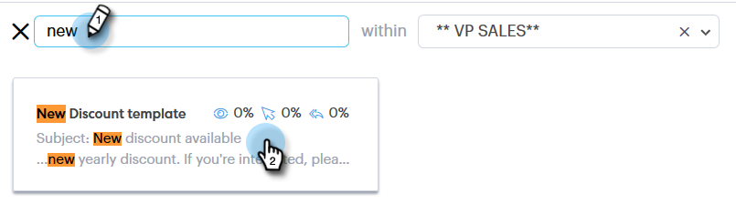
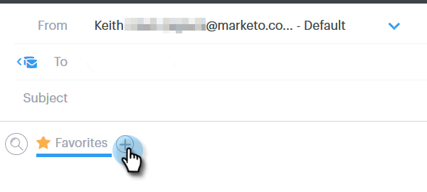
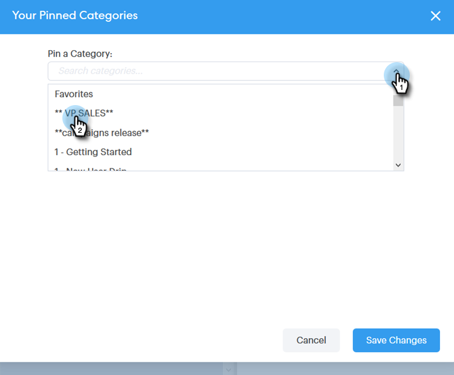
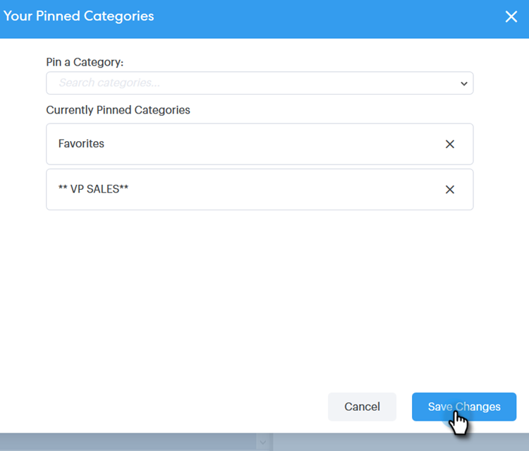

# Utilizzo di un modello nella finestra Componi {#using-a-template-in-the-compose-window}

## Ricerca e utilizzo dei modelli {#finding-and-using-templates}

1. Crea la bozza dell&#39;e-mail (esistono diversi modi per farlo, in questo esempio stiamo scegliendo **[!UICONTROL Compose]** nell&#39;intestazione).

   

1. Compilare il campo [!UICONTROL To].

   

1. Fai clic sull’icona di ricerca nella sezione del modello per aprire il campo di ricerca del modello.

   

1. Selezionare una categoria in cui eseguire la ricerca oppure selezionare Tutte per eseguire la ricerca in tutte le categorie.

   

1. Cerca per nome modello, riga oggetto o corpo dell’e-mail. Fai clic sul modello desiderato per selezionarlo.

   

   >[!NOTE]
   >
   >Selezionando un altro modello, tutte le informazioni presenti nell’editor verranno sostituite. Se apporti modifiche, assicurati di copiarle prima di selezionare un altro modello.

## Aggiunta di categorie di modelli nella finestra Componi {#pinning-template-categories-in-the-compose-window}

**fino a cinque** categorie di modelli specifiche preferite per accedere rapidamente ai modelli più utilizzati.

1. Crea la bozza dell&#39;e-mail (esistono diversi modi per farlo, in questo esempio stiamo scegliendo **[!UICONTROL Compose]** nell&#39;intestazione).

   

1. Fai clic sull&#39;icona **+** accanto a [!UICONTROL Favorites].

   

1. Fare clic sul menu a discesa **[!UICONTROL Pin a Category]** e selezionare la categoria desiderata.

   

1. Al termine, fai clic su **[!UICONTROL Save Changes]** (facoltativo: ripeti il passaggio 3 per aggiungerne altri).

   

   >[!TIP]
   >
   >Puoi riorganizzare le categorie bloccate semplicemente trascinandole e rilasciandole prima di salvare le modifiche.

   

   >[!NOTE]
   >
   >**[!UICONTROL Favorites]** per impostazione predefinita. Contiene i modelli e-mail preferiti, non le categorie.

   La categoria selezionata è bloccata.
