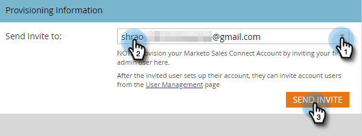

# Accesso alla nuova istanza di Sales Connect {#accessing-your-new-sales-connect-instance}

>[!NOTE]
>
>**Autorizzazioni amministratore richieste.**

Una volta acquistata Sales Connect, nell’istanza Marketo verrà visualizzata una nuova pagina di integrazione. Utilizzare questa pagina per invitare il primo utente ed eseguire il provisioning della relativa istanza di Sales Connect.

1. In Marketo, fare clic su **[!UICONTROL Admin]**.

   

1. Fai clic su **[!UICONTROL Sales Connect]**.

   

1. Selezionare da un elenco di amministratori di Marketo da invitare e fare clic su **[!UICONTROL Send Invite]**.

   

L&#39;utente riceverà un&#39;e-mail con i passaggi necessari per accedere all&#39;account Sales Connect.

>[!NOTE]
>
>Gli utenti aggiuntivi **non** verranno aggiunti tramite Marketo e verranno aggiunti tramite la pagina Gestione utenti di Sales Connect. [Fai clic qui](/help/marketo/product-docs/marketo-sales-connect/admin/invite-users.md) per ulteriori informazioni sull&#39;aggiunta di altri utenti.
