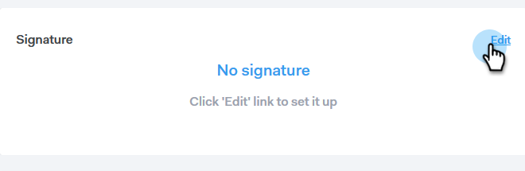

# Aggiungere la firma e-mail {#add-your-email-signature}

Vogliamo che l’invio di e-mail da Sales Connect avvenga come un’esperienza fluida dal tuo client e-mail. Un ottimo modo per farlo è aggiungere la tua firma e-mail.

1. Fare clic sull&#39;icona ingranaggio e selezionare **[!UICONTROL Settings]**.

   

1. In [!UICONTROL My Account], selezionare **[!UICONTROL Email Settings]**.

   

1. Fare clic su **[!UICONTROL Address and Signature]** e selezionare l&#39;identità e-mail per la quale si desidera creare una firma.

   

1. Nella scheda [!UICONTROL Signature], fai clic su **[!UICONTROL Edit]**.

   

1. Immettere il testo o le immagini desiderate e fare clic su **[!UICONTROL Save]**.

   

   >[!TIP]
   >
   >Assicurati che la firma nella schermata di composizione sia simile a quella elencata nel client e-mail.
