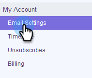

# Aggiungere la firma e-mail {#add-your-email-signature}

Vogliamo che l’invio di e-mail da Sales Connect avvenga come un’esperienza fluida dal tuo client e-mail. Un ottimo modo per farlo è aggiungere la tua firma e-mail.

1. Fai clic sull’icona a forma di ingranaggio e seleziona **Impostazioni**.

   

1. In Il mio account, seleziona **Impostazioni e-mail**.

   

1. Clic **Indirizzo e firma** e seleziona l’identità e-mail per la quale desideri creare una firma.

   

1. Nella scheda Firma, fare clic su **Modifica**.

   

1. Inserisci il testo (o le immagini) desiderato e fai clic su **Salva**.

   

   >[!TIP]
   >
   >Assicurati che la firma nella schermata di composizione sia simile a quella elencata nel client e-mail.
