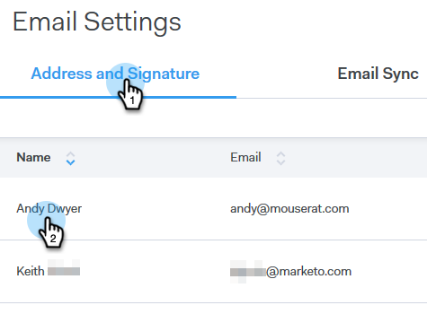

# Aggiungi firma e-mail {#add-your-email-signature}

Desideriamo inviare e-mail da Sales Connect come un&#39;esperienza senza soluzione di continuità durante l&#39;invio dal client di posta elettronica. Un ottimo modo per farlo è aggiungere la tua firma e-mail.

1. Fate clic sull&#39;icona a forma di ingranaggio e selezionate **Impostazioni**.

   

1. In Account personale, selezionate Impostazioni **e-** mail.

   

1. Fare clic su **Indirizzo e firma** e selezionare l&#39;identità e-mail per la quale si desidera creare una firma.

   

1. Nella scheda Firma fare clic su **Modifica**.

   

1. Inserite il testo desiderato (o le immagini) e fate clic su **Salva**.

   

   >[!TIP]
   >
   >Accertatevi che la firma nella schermata di composizione sia simile a quella elencata nel client e-mail.
