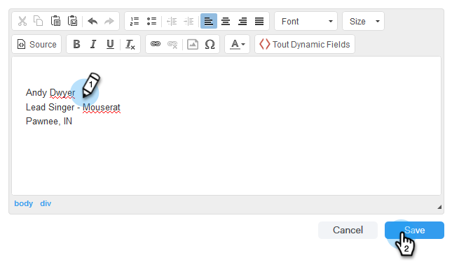

# Aggiungi firma e-mail {#add-your-email-signature}

Desideriamo inviare e-mail da Sales Connect per sentirci come un&#39;esperienza senza soluzione di continuità durante l&#39;invio dal proprio client e-mail. Un ottimo modo per farlo è aggiungere la tua firma e-mail.

1. Fai clic sull’icona a forma di ingranaggio e seleziona **Impostazioni**.

   

1. In Il mio account, seleziona **Impostazioni e-mail**.

   

1. Fai clic su **Indirizzo e firma** e selezionare l’identità e-mail per la quale si desidera creare una firma.

   

1. Nella scheda Firma fare clic su **Modifica**.

   

1. Inserisci il testo desiderato (o le immagini) e fai clic su **Salva**.

   

   >[!TIP]
   >
   >Accertati che la firma nella schermata di composizione sia simile alla firma elencata nel client e-mail.
