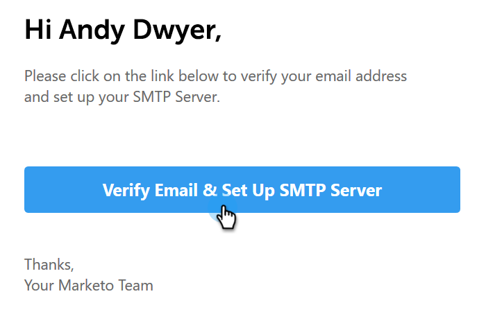

# Verifica e-mail {#verify-your-email}

Se disponete di un&#39;identità e-mail non verificata, seguite i passaggi indicati di seguito.

1. Fate clic sull&#39;icona dell&#39;ingranaggio in alto a destra e scegliete **Impostazioni**.

   

1. In Account personale, fate clic su **Impostazioni e-mail**.

   

1. In Indirizzo e firma, individuare l&#39;identità dell&#39;e-mail che si desidera verificare e fare clic su **Invia nuovamente verifica e-mail**. Verrà inviata una nuova e-mail di verifica.

   

1. Fare clic su **Invia di nuovo**.

   

1. Il destinatario quindi apre l&#39;e-mail e segue i passaggi per verificare l&#39;identità dell&#39;e-mail.

   
