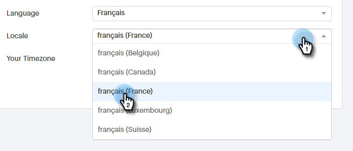

# Gestire il tuo profilo {#manage-your-profile}

Nella pagina [!UICONTROL My Profile] è possibile aggiornare il proprio nome, la lingua/lingua/fuso orario dell&#39;account e modificare la password.

## Dettagli account {#account-details}

Qui puoi aggiornare il tuo nome e/o la tua password.

1. Fare clic sull&#39;icona ingranaggio e selezionare **[!UICONTROL Settings]**.

   

1. Per impostazione predefinita, viene aperta la pagina Il mio profilo. Per aggiornare il nome, digitare le modifiche e fare clic su **[!UICONTROL Save]**.

   

>[!NOTE]
>
>Il tuo indirizzo e-mail è impostato per essere visualizzato solo. Se è necessario modificare anche questa impostazione, contatta il [supporto Marketo](https://nation.marketo.com/t5/Support/ct-p/Support).

È inoltre possibile modificare la password in questa sezione. I passaggi sono descritti in questo documento.

## Integrazioni {#your-integrations}

Nella parte destra della pagina, la sezione [!UICONTROL Your Integrations] fornisce lo stato di tutte le connessioni dell&#39;account.

>[!NOTE]
>
>Se si utilizza Exchange On Prem con Sales Connect, non verranno aggiornati i controlli di integrità dell&#39;integrazione del canale di consegna (prima riga) o del tracciamento delle risposte (seconda riga). Stiamo lavorando per supportare questa funzione in una versione futura.

## Fuso orario {#time-zone}

Ecco come modificare la lingua, la lingua e/o il fuso orario dell’account.

>[!NOTE]
>
>Lingue supportate: inglese, francese, tedesco, giapponese, portoghese, spagnolo.

1. Fare clic sull&#39;icona ingranaggio e selezionare **[!UICONTROL Settings]**.

   

1. Per cambiare lingua, fare clic sul menu a discesa **[!UICONTROL Language]** e scegliere.

   

1. La lingua si riferisce alla regione in cui si parla quella lingua. Fare clic sul menu a discesa **[!UICONTROL Locale]** e scegliere.

   

1. Fare clic sul menu a discesa **[!UICONTROL Your Timezone]** e scegliere.

   

1. Al termine, fai clic su **[!UICONTROL Save]**.

   

Et voilà!
