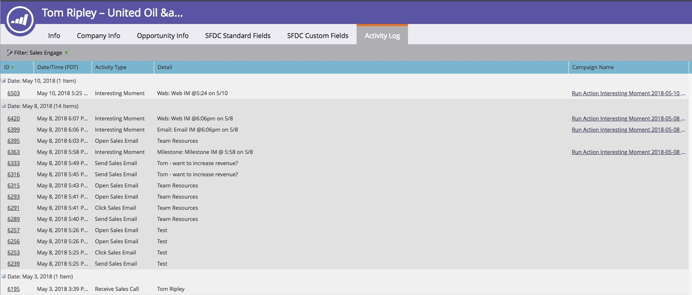

# Panoramica di Sales Connect {#sales-connect-overview}

Marketo Sales Connect è una soluzione di supporto per le vendite multi-sfaccettature con una varietà di funzioni, che vi aiuta a stimolare il coinvolgimento durante tutto il ciclo di vendita.

>[!AVAILABILITY]
>
>Non tutti hanno acquistato questa funzione. Contatta il team dell&#39;account Adobe (il tuo Account Manager) per maggiori informazioni.

## Feed live {#the-live-feed}

I rappresentanti possono visualizzare [coinvolgimento in tempo reale](/help/marketo/product-docs/marketo-sales-connect/email/the-live-feed/live-feed-overview.md) di contenuti di marketing e di vendita.

## Visualizzazione dettagli persona {#person-detail-view}

Accesso [statistiche dettagliate sulle persone](/help/marketo/product-docs/marketo-sales-connect/people/person-detail-view.md).

## Consulta Risultati nel registro delle attività di Marketo {#see-results-in-your-marketo-activity-log}

Scopri come le tue prospettive sono coinvolte nelle tue attività di vendita.

<table> 
 <tbody> 
  <tr> 
   <th>Tipo di attività</th> 
   <th>Descrizione</th> 
  </tr> 
  <tr> 
   <td>
Invia e-mail di vendita
</td> 
   <td>
L'utente ha inviato un'e-mail di vendita da Sales Connect.
</td> 
  </tr> 
  <tr> 
   <td>
Apri e-mail di vendita
</td> 
   <td>
Il lead ha aperto un messaggio e-mail di vendita inviato da Sales Connect.
</td> 
  </tr> 
  <tr> 
   <td>
Fai clic su E-mail di vendita
</td> 
   <td>
Il lead ha fatto clic su un collegamento presente in un messaggio e-mail di vendita inviato da Sales Connect.
</td> 
  </tr> 
  <tr> 
   <td colspan="1">
Ricevi e-mail di vendita
</td> 
   <td colspan="1">
Il lead ha ricevuto un'e-mail inviata da Sales Connect.
</td> 
  </tr> 
  <tr> 
   <td colspan="1">
Ricevi chiamata di vendita
</td> 
   <td colspan="1">
Il lead ha ricevuto una chiamata da un venditore che utilizza <a href="/help/marketo/product-docs/marketo-sales-connect/phone/sales-phone-overview.md" rel="nofollow">Telefono vendita</a>.
</td> 
  </tr> 
  <tr> 
   <td colspan="1">
Aggiungi alla campagna di vendita
</td> 
   <td colspan="1">
Il lead è stato aggiunto a una campagna di vendita creata in Sales Connect (nella pagina Campagne ).
</td> 
  </tr> 
  <tr> 
   <td colspan="1">
Rimosso Dalla Campagna Di Vendita
</td> 
   <td colspan="1">
Il lead è stato rimosso da una campagna di vendita.
</td> 
  </tr> 
  <tr> 
   <td colspan="1">
Momento interessante
</td> 
   <td colspan="1">
Il lead ha avuto un momento interessante generato in Marketo.
</td> 
  </tr> 
 </tbody> 
</table>

## Condivisione di campagne di marketing {#share-marketing-campaigns}

Crea una semplice campagna intelligente per consentire agli utenti di vendita di accedere a [Dati della campagna Marketo](/help/marketo/product-docs/marketo-sales-connect/marketo/make-a-campaign-visible-to-sales-connect-users.md).

Pronti per iniziare? Per le istruzioni di configurazione, fai clic sul link qui sotto.

>[!MORELIKETHIS]
>
>[Guida introduttiva per gli amministratori di Sales Connect](/help/marketo/product-docs/marketo-sales-connect/getting-started/getting-started-guide-for-sales-connect-admins.md)
