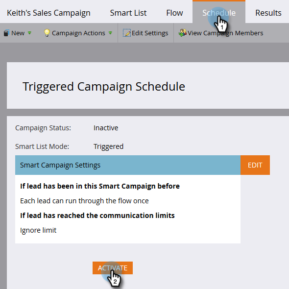

# Rendi una campagna visibile agli utenti Sales Connect {#make-a-campaign-visible-to-sales-connect-users}

Le campagne possono essere condivise solo se sono rese visibili. Ecco come farlo.

1. Seleziona (o crea) la campagna da condividere.

   

1. Fare clic sulla scheda **Elenco avanzato**.

   

1. Aggiungere la campagna come trigger richiesto.

   

1. Per l&#39;origine, scegliere &quot;is&quot; **API servizio Web**.

   

1. Fare clic sulla scheda **Flusso**.

   

1. Aggiungi l’azione di flusso Momento di interesse.

   

1. Per Tipo, selezionare **Web**.

   

1. Nella casella Descrizione scrivere un messaggio al team vendite. In questo esempio utilizziamo i token per specificare il modulo compilato.

   

1. Fai clic sulla scheda **Pianifica** e **Attiva** la campagna.

   
