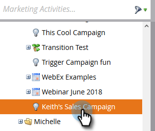

# Rendi una campagna visibile a [!DNL Sales Connect] utenti {#make-a-campaign-visible-to-sales-connect-users}

Le campagne possono essere condivise solo se sono rese visibili. Ecco come farlo.

1. Seleziona (o crea) la campagna da condividere.

   

1. Fai clic sulla scheda **[!UICONTROL Smart List]**.

   

1. Aggiungi il trigger [!UICONTROL Campaign is Requested].

   

1. Per l&#39;origine, scegliere &quot;[!UICONTROL is]&quot; **[!UICONTROL Web Service API]**.

   

1. Fai clic sulla scheda **[!UICONTROL Flow]**.

   

1. Aggiungi l&#39;azione di flusso [!UICONTROL Interesting Moment].

   

1. Per [!UICONTROL Type], seleziona **[!UICONTROL Web]**.

   

1. Nella casella [!UICONTROL Description], scrivi un messaggio al team vendite. In questo esempio utilizziamo i token per specificare il modulo compilato.

   

1. Fare clic sulla scheda **[!UICONTROL Schedule]** e **[!UICONTROL Activate]** la campagna.

   
