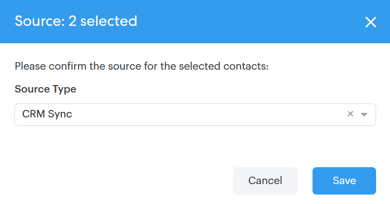

# Azioni di massa sulle persone {#bulk-actions-on-people}

Ci sono alcune cose che puoi fare con i tuoi contatti in massa per risparmiare tempo.

Il primo passo per tutte le azioni di massa disponibili consiste nel selezionare due o più contatti e fare clic sul dato (tre punti verticali).

## Aggiungi persone al gruppo {#add-people-to-group}

Aggiungete più persone a un gruppo allo stesso tempo.

## Origine {#source}

Assegniamo automaticamente una fonte a ogni contatto che entra nel database. Utilizzate questo passaggio per aggiornare tale origine.

>[!NOTE]
>
>Le origini non sono personalizzabili.

## Autorizzazione {#authorization}

In conformità con [GDPR](https://eugdpr.org/), utilizzare l&#39;autorizzazione per indicare in che modo hai ricevuto l&#39;autorizzazione per interagire con questi contatti.

## Annulla sottoscrizione {#unsubscribe}

Esegui un&#39;iscrizione in blocco sui contatti che non desiderano più ricevere la corrispondenza da te.

## Elimina {#delete}

Elimina i contatti in blocco. I passaggi completi sono disponibili [qui](/help/marketo/product-docs/marketo-sales-connect/people/managing-contacts/creating-and-deleting-contacts.md).

