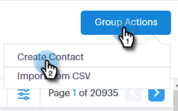
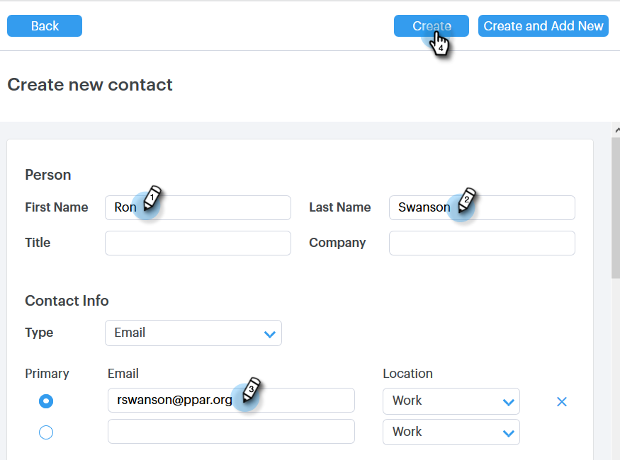

# Creazione ed eliminazione di contatti {#creating-and-deleting-contacts}

## Creazione di contatti {#creating-contacts}

1. Nella pagina [!UICONTROL People], fare clic sul pulsante **[!UICONTROL Group Actions]** e selezionare **[!UICONTROL Create Contact]**.

   

1. Immetti nome/cognome e indirizzo e-mail, insieme a eventuali altre informazioni desiderate. Al termine, fai clic su **[!UICONTROL Create]** oppure su **[!UICONTROL Create and Add New]** per aggiungere altri contatti.

   

   >[!TIP]
   >
   >Aggiungere più contatti contemporaneamente? [Fai clic qui](/help/marketo/product-docs/marketo-sales-connect/people/managing-contacts/import-contacts-via-csv.md) per scoprire come importare i contatti tramite CSV.

## Eliminazione dei contatti {#deleting-contacts}

1. Nella pagina [!UICONTROL People], seleziona la casella del contatto da eliminare.

   

   >[!NOTE]
   >
   >Per eliminare più contatti, è sufficiente selezionare più persone. I passaggi rimanenti sarebbero gli stessi.

1. Fare clic sul punto (tre punti verticali) e selezionare **[!UICONTROL Delete]**.

   

1. Fai clic su **[!UICONTROL Delete Contact]** per confermare.

   
