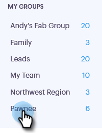

# Come condividere un gruppo {#how-to-share-a-group}

La condivisione di un gruppo di lead o contatti con il team è molto semplice in Sales Connect.

1. Passate alla scheda **Persone**.

   

1. Selezionate il gruppo da condividere.

   

1. Fare clic sul pulsante **Azioni gruppo** e selezionare **Condividi gruppo**.

   

1. Selezionate il team secondario con cui desiderate condividere e aggiungete una nota al team.

   

1. Fare clic su **Condividi**.

   
