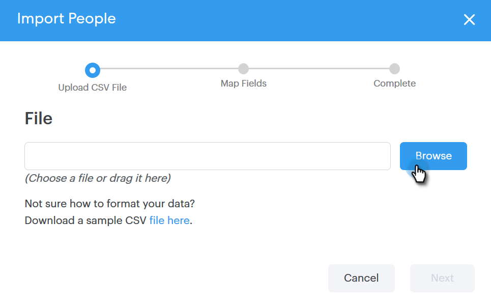

# Importa contatti tramite CSV {#import-contacts-via-csv}

La disponibilità di contatti nella pagina Persone è importante perché è il punto in cui effettuiamo il pulling per compilare automaticamente le informazioni personalizzate nei campi dinamici dei modelli. Accertatevi di disporre almeno di un nome e di un indirizzo e-mail per ogni contatto nel CSV e di eseguire la mappatura a tali campi.

1. Selezionate il gruppo (o createne uno nuovo) nella scheda Persone.

   

1. Fare clic su **Azioni gruppo** e selezionare **Importa CSV**.

   

1. Fare clic su **Sfoglia**.

   

1. Individuare il file sul computer e selezionarlo.

   >[!NOTE]
   >
   >I gruppi sono limitati a 1000 contatti.

1. Fare clic su **Next**.

   

1. Mappate le colonne del CSV sui rispettivi campi in Sales Connect. Fare clic su **Next** al termine.

   
