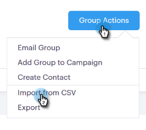

# Importare contatti tramite CSV {#import-contacts-via-csv}

Avere contatti nella pagina Persone è importante perché è il punto in cui effettuiamo il pull da a compilare automaticamente le informazioni personalizzate nei campi dinamici dei modelli. Assicurati di avere almeno un nome e un indirizzo e-mail per ogni contatto nel CSV e di eseguire la mappatura su tali campi.

1. Seleziona il gruppo (o creane uno nuovo) nella scheda Persone.

   

1. Fai clic su **Azioni gruppo** e seleziona **Importare CSV**.

   

1. Fai clic su **Sfoglia**.

   

1. Individuare il file sul computer e selezionarlo.

   >[!NOTE]
   >
   >I gruppi sono limitati a 1000 contatti.

1. Fai clic su **Successivo**.

   

1. Mappa le colonne del CSV sui rispettivi campi in Sales Connect. Fai clic su **Successivo** al termine.

   
