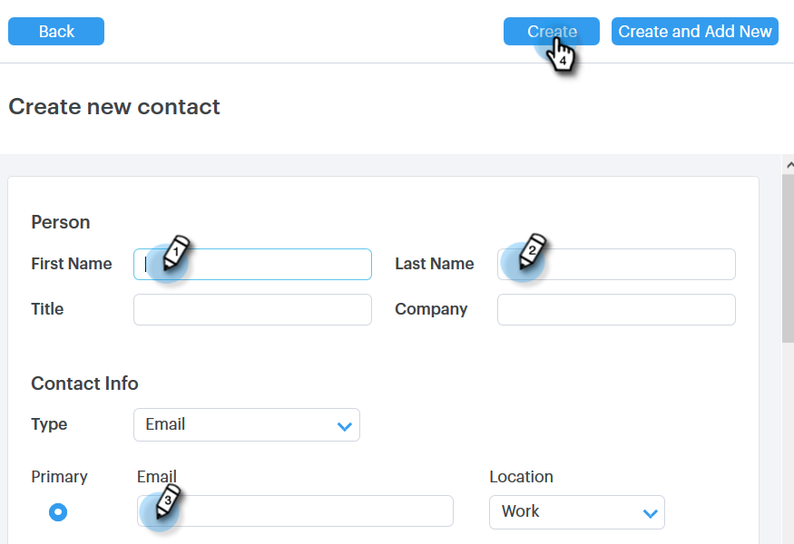
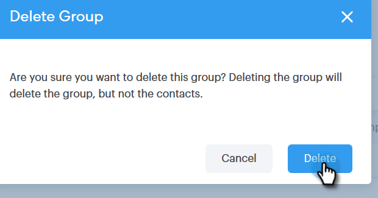

# Gestisci gruppi {#manage-groups}

Scopri come gestire i gruppi in Sales Connect.

## Creare un gruppo {#create-a-group}

1. Nella pagina Persone, fai clic su **+** accanto a Gruppi.

   

1. Assegna un nome al gruppo e fai clic su **Crea**.

   

   Tutto qui!

## Aggiungere contatti a un gruppo {#add-contacts-to-a-group}

1. Nella pagina Persone individuare e selezionare il gruppo a cui si desidera aggiungere le persone.

   

1. Clic **Azioni gruppo** e seleziona **Crea contatto**.

   

   >[!NOTE]
   >
   >Verrà aggiunto un contatto alla volta. Per aggiungere più contatti contemporaneamente, eseguire le operazioni seguenti [questi passaggi](/help/marketo/product-docs/marketo-sales-connect/people/managing-contacts/import-contacts-via-csv.md).

1. Inserisci le informazioni del contatto e fai clic su **Crea** (o **Crea e aggiungi nuovo** per aggiungerne un altro).

   

   E hai finito!

   >[!NOTE]
   >
   >Per visualizzare i nuovi contatti aggiunti, potrebbe essere necessario premere Aggiorna.

## Condividere un gruppo {#share-a-group}

1. Nella pagina Persone individuare e selezionare il gruppo che si desidera condividere.

   

1. Fai clic sul punto (tre punti verticali) e seleziona **Condividi**.

   

1. Fai clic sull’elenco a discesa e scegli il team con cui vuoi condividere il gruppo.

   

1. Clic **Condividi**.

   

   Il gruppo è ancora di tua proprietà, ma ora verrà visualizzato in Gruppi di team.

## Annullare la condivisione di un gruppo {#unshare-a-group}

1. Nella pagina Persone individuare e selezionare il gruppo che si desidera annullare la condivisione.

   

1. Fai clic sul punto (tre punti verticali) e seleziona **Condividi**.

   

1. Fai clic su **X** accanto al team con cui hai condiviso il gruppo, quindi fai clic su fuori dal modale.

   

   Il gruppo non è più condiviso.

## Rinominare un gruppo {#rename-a-group}

1. Nella pagina Persone individuare e selezionare il gruppo da rinominare.

   

1. Fai clic sul punto (tre punti verticali) e seleziona **Rinomina**.

   

1. Digita il nuovo nome e premi Invio.

   

## Eliminare un gruppo {#delete-a-group}

1. Nella pagina Persone individuare e selezionare il gruppo che si desidera eliminare.

   

1. Fai clic sul punto (tre punti verticali) e seleziona **Elimina**.

   

1. Clic **Elimina** per confermare.

   
