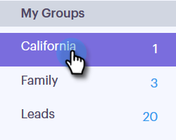

# Gestisci gruppi {#manage-groups}

Scoprite come gestire i gruppi in Sales Connect.

## Creare un gruppo {#create-a-group}

1. Nella pagina Persone, fate clic sul segno **più** accanto a Gruppi.

   

1. Denominate il gruppo e fate clic su **Crea**.

   

   È tutto!

## Aggiunta di contatti a un gruppo {#add-contacts-to-a-group}

1. Nella pagina Persone, individuate e selezionate il gruppo a cui desiderate aggiungere le persone.

   

1. Fate clic su Azioni **** gruppo e selezionate **Crea contatto**.

   

   >[!NOTE]
   >
   >Questo aggiungerà un contatto alla volta. Per aggiungere contemporaneamente più contatti, procedere come [segue](http://docs.marketo.com/x/VADb).

1. Compila le informazioni del contatto e fai clic su **Crea** (oppure su **Crea e aggiungi nuovo** per aggiungerne un altro).

   

   E hai finito!

   >[!NOTE]
   >
   >Potrebbe essere necessario premere Aggiorna per visualizzare eventuali nuovi contatti aggiunti.

## Condivisione di un gruppo {#share-a-group}

1. Nella pagina Persone, individuate e selezionate il gruppo da condividere.

   

1. Fate clic sul punto (tre punti verticali) e selezionate **Condividi**.

   

1. Fate clic sul menu a discesa e scegliete il team con cui desiderate condividere il gruppo.

   

1. Fate clic su **Condividi**.

   

   Il gruppo è ancora proprietario, ma ora verrà visualizzato in Gruppi team.

## Annullamento della condivisione di un gruppo {#unshare-a-group}

1. Nella pagina Persone, individuate e selezionate il gruppo da annullare la condivisione.

   

1. Fate clic sul punto (tre punti verticali) e selezionate **Condividi**.

   

1. Fate clic sulla **X** accanto al team con cui avete condiviso il gruppo, quindi fate clic fuori dal modale.

   

   Il gruppo ora non è condiviso.

## Rinominare un gruppo {#rename-a-group}

1. Nella pagina Persone, individuate e selezionate il gruppo da rinominare.

   

1. Fare clic sul punto (tre punti verticali) e selezionare **Rinomina**.

   

1. Digitare il nuovo nome e premere Invio.

   

## Eliminare un gruppo {#delete-a-group}

1. Nella pagina Persone, individuate e selezionate il gruppo da eliminare.

   

1. Fate clic sulla data (tre punti verticali) e selezionate **Elimina**.

   

1. Fate clic su **Elimina** per confermare.

   

