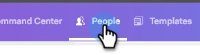

# Visualizzazione dettagli persona {#person-detail-view}

La vista Dettagli persona fornisce un profilo dettagliato di ogni persona nel tuo account MSC.

## Come accedere {#how-to-access}

1. Per accedere alla visualizzazione dettagli persona, fare clic sulla scheda **[!UICONTROL People]**.

   

1. Fai clic sulla persona desiderata.

   

   >[!TIP]
   >
   >Praticamente ovunque tu veda il nome di una persona, puoi fare clic su di esso e passare alla sua Visualizzazione dettagli persona.

## Scheda Informazioni su {#about-tab}

Include tutte le informazioni di contatto della persona.

**Scheda Contatto**

* Contiene informazioni di contatto come: indirizzo e-mail, nome, società, titolo, numero di telefono e collegamenti ai social media

**Gruppi**

* Visualizza e gestisce i gruppi di cui questa persona è membro

**Informazioni account**

* Può aggiungere una persona a [!DNL Salesforce]
* Recupera informazioni su account e lead/contatti da [!DNL Salesforce]

**Campi personalizzati**

* Aggiungere o rimuovere campi personalizzati che possono essere utilizzati come campi dinamici nei modelli e nelle campagne

**Note**

* Creare note personalizzate

## Scheda Coinvolgimento {#engagement-tab}

Scopri in che modo questa persona è interessata alla tua attività.

**Attività Sales Connect**

* Visualizza le attività di coinvolgimento dalle e-mail e dalle campagne di vendita

**Attività di marketing**

* Scopri in che modo la tua persona è impegnata con le campagne di marketing

## Scheda Cronologia {#history-tab}

Mostra la cronologia della tua attività. Include e-mail, campagne e chiamate.

**[!UICONTROL Sales Campaigns]**

* Visualizza tutte le campagne attive o completate a cui appartiene questa persona

**[!UICONTROL Marketing Campaigns]**

* Visualizza tutte le campagne di marketing di cui questa persona è membro

**[!UICONTROL Sales Emails]**

* Visualizza tutte le e-mail che hai inviato a questa persona e le metriche di coinvolgimento

**[!UICONTROL Sales Calls]**

* Visualizza le chiamate effettuate a questa persona

## Scheda Attività {#tasks-tab}

Gestisci le attività associate a questa persona.

Azioni eseguibili:

* Modificare o eliminare un’attività
* Visualizza la data di scadenza
* Fai clic sul Tipo per avviare il Telefono di vendita se Chiamata, E-mail Componi se E-mail, Linkedin se Inmail e Nota personalizzata se Personalizzato.
* Contrassegna un&#39;attività come completata
