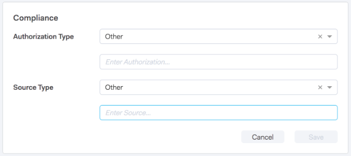
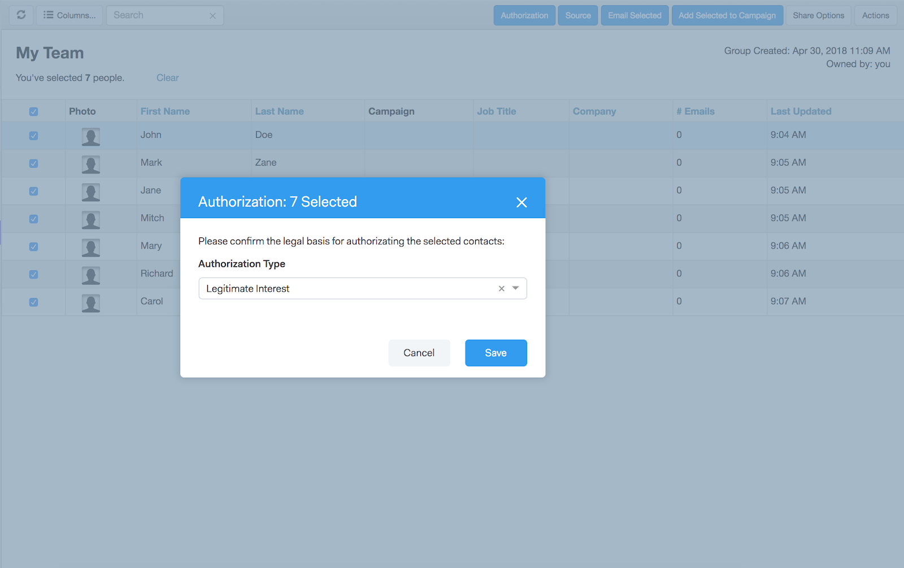

# Conformità alle regole di vendita di Adobe Connect e GDPR {#sales-connect-and-gdpr-compliance}

Il Regolamento generale sulla protezione dei dati (General Data Protection Regulation, GDPR) è la legislazione dell&#39;Unione europea entrata in vigore il 25 maggio 2018.

## Panoramica {#overview}

Il suo obiettivo è rafforzare i diritti degli interessati nell&#39;Unione europea (UE) e nello Spazio economico europeo (SEE) per quanto riguarda il modo in cui i loro dati personali sono utilizzati e protetti. Per &quot;Dati personali&quot; si intendono tutte le informazioni relative a una persona fisica identificata o identificabile.

Il GDPR si articola intorno a sei principi chiave (descritti in dettaglio nell&#39;articolo 5 della legislazione):

1. Trasparenza su come verranno utilizzati i dati e per quali scopi.
1. Assicurare che i dati raccolti siano utilizzati solo per gli scopi esplicitamente specificati al momento della raccolta.
1. Limitazione della raccolta di dati a quanto necessario per soddisfare lo scopo per il quale viene raccolta.
1. Verificare che i dati siano precisi.
1. Conservare i dati per tutto il tempo necessario allo scopo previsto.
1. Prevenzione contro l&#39;uso non autorizzato o la perdita accidentale dei dati attraverso l&#39;adozione di misure di sicurezza adeguate.

Inoltre, c&#39;è un nuovo requisito di responsabilità per dimostrare come la conformità viene gestita e monitorata. Ciò significa conservare le registrazioni di come e perché sono stati raccolti i dati personali, nonché la documentazione dei processi messi in atto per proteggerli.

## A chi si applica? {#to-whom-does-it-apply}

Il GDPR si applica a qualsiasi organizzazione all&#39;interno o all&#39;esterno dell&#39;UE che commercializza beni o servizi e/o che monitori il comportamento degli interessati all&#39;interno dell&#39;UE e del SEE. Se in Europa si tratta di soggetti che trattano i propri dati personali, questa legislazione si applica a voi. Le sanzioni per il mancato rispetto delle norme sono significative, con ingenti ammende per coloro che violano il regolamento; l&#39;ammenda massima per una singola violazione è di 20 milioni di euro o, se superiore, del 4% del fatturato mondiale annuo.

## Implicazioni per il marketing {#implications-for-marketing}

Gli esperti di marketing mirano a creare esperienze cliente personali e umane, basate sulla fiducia e fornite con cura. Anche se il GDPR non utilizza questi termini, gli obiettivi sono gli stessi: rispettare i diritti dei clienti e guadagnarsi la loro fiducia. Per creare e mantenere tale fiducia, gli esperti di marketing devono essere associati a come, quando e perché i loro clienti desiderano essere coinvolti. È fondamentale che le preferenze dei clienti siano rispettate, non solo come requisito legale, ma anche come base per pratiche di coinvolgimento incentrate sui clienti.

Il modo in cui gli esperti di marketing affrontano queste aspettative più elevate in relazione alla raccolta, all&#39;uso e alla sicurezza dei dati personali che vengono utilizzati regolarmente nel corso del loro lavoro è fondamentale, e Marketo può contribuire a soddisfare tali aspettative.

Esistono due aspetti chiave del GDPR in cui gli esperti di marketing devono esaminare le pratiche passate, attuali e future. Il primo è il consenso dell&#39;individuo a trattare i propri dati personali, e il secondo è la responsabilità, ossia la capacità di dimostrare come i principi del GDPR sono seguiti.

Forniamo informazioni approfondite sul consenso e sulla responsabilità all&#39;interno della piattaforma Marketo nel nostro e-book, [GDPR e The Marketer](https://www.marketo.com/ebooks/the-gdpr-and-the-marketer/). In questo articolo, tuttavia, ci concentreremo specificatamente sulle nuove funzioni di Marketo Sales Connect che aiuteranno la vostra azienda a rispettare le regole GDPR.

## Conformità al Regolamento GDPR in Marketo Sales Connect {#gdpr-compliance-in-marketo-sales-connect}

Marketo Sales Connect è un&#39;applicazione potente, parte della Piattaforma di coinvolgimento di Marketo, che fornisce un unico flusso di lavoro e una vista che consentono a vendite e marketing di guidare collettivamente la pipeline più rapidamente attraverso il coinvolgimento collaborativo. Sono state create nuove funzionalità in Marketo Sales Connect, in particolare tenendo conto della conformità ai requisiti GDPR. Descriveremo tutte e tre le funzioni e illustreremo in che modo, se utilizzate correttamente, aiuteranno gli sforzi di conformità ai requisiti GDPR della vostra organizzazione.

## Scheda di conformità {#compliance-card}

Marketing Sales Connect include una scheda di conformità nella visualizzazione Dettagli persona per fornire informazioni chiave sul tipo di autorizzazione di un contatto e sul relativo tipo di origine. Questo consente agli utenti di aggiungere e monitorare facilmente le informazioni essenziali per la privacy dei dati, e li aiuta a prendere decisioni più informate sulla strategia di campagna/sensibilizzazione.

Tipo autorizzazione contatto

All&#39;interno della scheda di conformità, gli utenti possono tenere traccia della base giuridica per l&#39;elaborazione dei dati personali di un contatto tramite il menu a discesa Autorizzazione. La comprensione del tipo di autorizzazione di un contatto aiuta gli utenti di Marketo Sales Connect a prendere decisioni più informate sulle pratiche di assistenza, garantendo che ogni campagna o coinvolgimento sia legale e appropriato.

Gli utenti possono scegliere tra diverse opzioni, tra cui:

* Consenso
* Interesse legittimo
* Esecuzione di un contratto
* Rispetto dell&#39;obbligo giuridico
* Protezione degli interessi vitali
* Interesse Pubblico/Autorità Ufficiale
* Altro

Tipo origine contatto

All&#39;interno della nuova scheda di conformità, gli utenti possono monitorare l&#39;origine di un contatto. Il tipo di origine definisce da dove provengono le informazioni di un contatto quando viene inizialmente caricato in Marketo Sales Connect. La comprensione del tipo di origine di un contatto aiuta anche a prendere decisioni sulle pratiche di sensibilizzazione, nonché a determinare quali altri sistemi o posizioni i dati personali vengono memorizzati, garantendo che ogni coinvolgimento sia in linea con la normativa GDPR.

Anche in questo caso, gli utenti possono scegliere tra diverse opzioni a discesa, tra cui:

* Sincronizzazione CRM
* Importa
* Caricamento manuale
* Estensione Chrome
* Altro

Modifica della scheda Conformità

Quando la visualizzazione Dettagli persona è aperta, fate clic su **Modifica** nella scheda Conformità.

Verranno visualizzati due menu a discesa: Tipo di autorizzazione e tipo di origine.

Se scegliete &quot;Consenso&quot; come Tipo di autorizzazione, due campi obbligatori: Verranno visualizzati &quot;Data del consenso&quot; e &quot;Scopo dell&#39;elaborazione&quot;. Questi due campi non sono applicabili ad altre opzioni.

Se per Tipo di autorizzazione o Tipo di origine è stato scelto &quot;Altro&quot;, potete immettere del testo per descrivere il Tipo di origine.

Bulk Actions** Marketo Sales Connect consente inoltre di aggiornare in massa i tipi di autorizzazione e origine di un contatto, risparmiando tempo prezioso nel processo di conformità.

Quando selezionate uno o più contatti dalla pagina Persone, i pulsanti Autorizzazione e Origine vengono visualizzati nel contenitore superiore. Utilizzando questi pulsanti, puoi impostare l&#39;autorizzazione o l&#39;origine di più contatti contemporaneamente.

Quando si fa clic sulla modalità Autorizzazione, viene visualizzato un pop-up con opzioni a discesa corrispondenti a quelle presenti nella scheda Conformità.

Dopo l&#39;aggiornamento del tipo di autorizzazione, riceverete una finestra a comparsa di conferma e potrete visualizzare i dettagli aggiornati nella scheda Conformità in visualizzazione Dettagli persona.

Analogamente, il tipo di origine può essere aggiornato in blocco anche facendo clic sul modale di origine.

Dopo aver selezionato il tipo di origine corretto per i contatti selezionati, verrà visualizzata una finestra di conferma per confermare l&#39;esito positivo dell&#39;aggiornamento.

## Esportazione dei dati di contatto da Marketing a Sales Connect {#exporting-contact-data-from-marketo-sales-connect}

Potete esportare le informazioni di contatto dalla visualizzazione Dettagli persona. L’esportazione scaricherà un file .CSV con le seguenti colonne:

<table> 
 <colgroup> 
  <col> 
  <col> 
  <col> 
 </colgroup> 
 <tbody> 
  <tr> 
   <td>Nome</td> 
   <td>Sito Web</td> 
   <td>Facebook</td> 
  </tr> 
  <tr> 
   <td>Cognome</td> 
   <td>Altro</td> 
   <td>Twitter</td> 
  </tr> 
  <tr> 
   <td>Azienda</td> 
   <td>Aggiornato a</td> 
   <td>LinkedIn</td> 
  </tr> 
  <tr> 
   <td>Titolo</td> 
   <td>Data di creazione</td> 
   <td>Esportato in</td> 
  </tr> 
  <tr> 
   <td>ID e-mail</td> 
   <td>ID Salesforce</td> 
   <td> </td> 
  </tr> 
  <tr> 
   <td>Numero di telefono</td> 
   <td>ID persona</td> 
   <td> </td> 
  </tr> 
 </tbody> 
</table>

>[!NOTE]
>
>Questo può essere fatto solo un contatto alla volta. Al momento non esiste alcuna funzionalità che consenta esportazioni in massa di contatti.

Per esportare le informazioni di contatto, fate clic sui tre punti verticali nell&#39;intestazione della visualizzazione Dettagli persona e selezionate **Esporta**. Il file .CSV viene scaricato automaticamente.

>[!NOTE]
>
>Il GDPR richiede anche la possibilità di eliminare i contatti dall&#39;interfaccia utente, ma Marketing Sales Connect possiede già questa funzionalità.

## Annulla sottoscrizione {#unsubscribes}

Un’area del GDPR comunemente fraintesa include i contatti che cancellano l’iscrizione al database dell’organizzazione. Per rispettare le nuove regole sulla protezione dei dati di coloro che scelgono di annullare l’iscrizione, in Marketo Sales Connect è stata inclusa la seguente funzionalità:

**Cancella collegamenti sottoscrizione:** i collegamenti Annulla sottoscrizione verranno aggiunti automaticamente a tutte le e-mail inviate dall’applicazione Web di Adobe Connect per garantire che ai contatti sia consentito un accesso facilitato per l’opzione di rifiuto.\
**Annulla sottoscrizione sincronizzazione:** gli utenti possono sincronizzare gli abbonamenti a e da CRM (Salesforce) per assicurare che le opzioni di rifiuto siano aggiornate.\
**Cronologia di annullamento sottoscrizione:** gli utenti possono visualizzare le opzioni di rifiuto e di annullamento della sottoscrizione nella visualizzazione Dettagli persona.\
**Annullamento sottoscrizione:** per rifiutare un contatto non iscritto è necessario che l&#39;utente disponga di privilegi di amministratore e dimostri che il contatto ha dato un nuovo consenso per contattarlo.

## Aggiornamenti futuri {#future-updates}

Come entusiasta sostenitore del potere e della centralità del cliente dell&#39;economia di coinvolgimento, Marketo capisce l&#39;importanza di mettere la privacy e la protezione dei dati nelle mani dell&#39;interessato. Come per le altre leggi sulla protezione dei dati, la conformità al GDPR richiede l&#39;impegno sia di Marketo che dei nostri clienti. Questo articolo è inteso ad aiutarti a utilizzare Marketo in modo appropriato per supportare la conformità ai requisiti GDPR della tua organizzazione.

Continueremo a seguire da vicino le linee guida del GDPR emanate dalle autorità di regolamentazione e dalla relativa legislazione. Gli aggiornamenti verranno inviati al Centro protezione all&#39;indirizzo [trust.marketo.com](https://trust.marketo.com).
