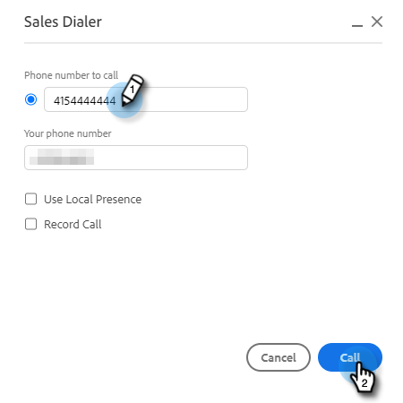

# Risultati chiamata {#call-outcomes}

Consenti ai team di vendita di selezionare i risultati delle chiamate durante le chiamate in modo che il tuo team possa comprendere l&#39;impatto delle attività di coinvolgimento dei clienti.

>[!NOTE]
>
>**Autorizzazioni di amministrazione richieste.**

## Abilita risultati chiamata {#enable-call-outcomes}

1. Fai clic sull’icona a forma di ingranaggio e seleziona **Impostazioni**.

   

1. In Impostazioni amministratore, seleziona **Dialogo**.

   

1. Seleziona **Abilita risultati chiamata**.

   

1. Scegli il tuo requisito finale di chiamata desiderato.

   

## Crea risultati chiamata {#create-call-outcomes}

1. Fai clic sull’icona a forma di ingranaggio e seleziona **Impostazioni**.

   

1. In Impostazioni amministratore, seleziona **Dialogo**.

   

1. Fai clic su **Gestisci risultati chiamate**.

   

1. Inserisci il nome del risultato della chiamata desiderato nel campo di testo.

   

1. Fai clic sull’elenco a discesa Risposta e scegli il tipo di risultato (in questo esempio scegliamo Risposta). Quindi fai clic su **Aggiungi**.

   

## Scegliere un risultato della chiamata {#choose-a-call-outcome}

I risultati delle chiamate sono stati abilitati. Gli utenti possono selezionarne uno durante una chiamata .

1. Fai clic sul pulsante di chiamata per avviare il dialer.

   

1. Immetti le informazioni sulla chiamata nella finestra di dialogo e fai clic su **Chiamata**.

   

1. Seleziona il risultato della chiamata che descrive meglio la chiamata.

   

1. Termina la chiamata.

   

1. Registra la chiamata.

   

>[!MORELIKETHIS]
>
>* [Segnala i motivi delle chiamate e i risultati delle chiamate a Salesforce](/help/marketo/product-docs/marketo-sales-connect/phone/log-call-reasons-and-call-outcomes-to-salesforce.md)
>* [Motivi della chiamata](/help/marketo/product-docs/marketo-sales-connect/phone/call-reasons.md)

