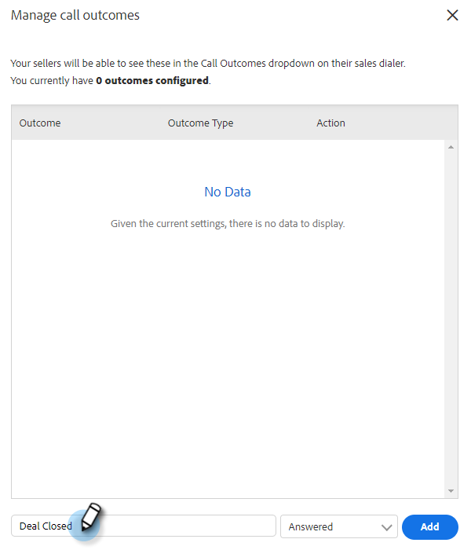

# Risultati della chiamata {#call-outcomes}

Consenti ai team di vendita di selezionare i risultati delle chiamate quando si effettuano le chiamate, in modo che il team possa comprendere l&#39;impatto delle attività di coinvolgimento dei clienti.

>[!NOTE]
>
>**Autorizzazioni di amministrazione richieste.**

## Abilita risultati chiamata {#enable-call-outcomes}

1. Fai clic sull’icona dell’ingranaggio e seleziona **Impostazioni**.

   

1. In Impostazioni amministratore seleziona **Connessione telefonica**.

   

1. Seleziona **Abilita risultati chiamata**.

   

1. Scegli il requisito di risultato della chiamata desiderato.

   

## Crea risultati chiamata {#create-call-outcomes}

>[!NOTE]
>
>Puoi creare un massimo di 15 risultati di chiamata.

1. Fai clic sull’icona dell’ingranaggio e seleziona **Impostazioni**.

   

1. In Impostazioni amministratore seleziona **Connessione telefonica**.

   

1. Clic **Gestire gli esiti delle chiamate**.

   

1. Immetti il nome del risultato della chiamata desiderato nel campo di testo.

   

1. Fare clic sull&#39;elenco a discesa Risposte e scegliere il tipo di risultato (in questo esempio si sta scegliendo Risposte). Quindi fai clic su **Aggiungi**.

   

## Scegli un risultato della chiamata {#choose-a-call-outcome}

Una volta abilitati i risultati della chiamata. Gli utenti possono selezionarne uno durante una chiamata.

1. Fare clic sul pulsante di chiamata per avviare la composizione.

   

1. Inserisci le informazioni sulla chiamata nella finestra di dialogo e fai clic su **Chiamata**.

   

1. Seleziona il risultato della chiamata che meglio descrive la chiamata.

   

1. Termina la chiamata.

   

1. Registra la chiamata.

   

>[!MORELIKETHIS]
>
>* [Registra i motivi e gli esiti delle chiamate a Salesforce](/help/marketo/product-docs/marketo-sales-connect/phone/log-call-reasons-and-call-outcomes-to-salesforce.md)
>* [Motivi della chiamata](/help/marketo/product-docs/marketo-sales-connect/phone/call-reasons.md)
